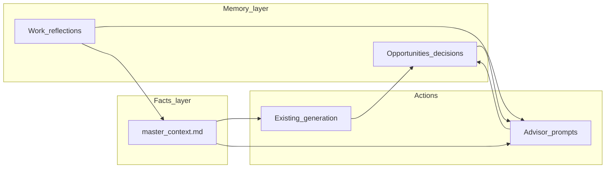

# RES → Second brain (apply smarter + grow on the job)

## Current baseline

You already have the core of a application copilot ([spec.md](spec.md)):

- **Facts**: [RES/master_context.md](RES/master_context.md) — roles, metrics, themes (single source of truth for generation).
- **Transactions**: [RES/generator.py](RES/generator.py) — JD keyword extraction, role selection, mission/skills/bullets/CL/Q&A.
- **UI**: [RES/app.py](RES/app.py) — job inputs, pre-flight, outputs, token/cost, keyword coverage.
- **Audit trail**: [RES/history.md](RES/history.md) — auto log entries are shallow (company, role, track, tokens); manual section describes richer logging but is not enforced.

The gap for a “second brain” is not only better prose—it is **persistent structured memory** (pipeline stages, decisions, outcomes, learnings) and **new reasoning modes** beyond “generate artifacts.” Separately, outputs can still read **competent-but-generic** unless voice and readability are first-class.

---

## Voice quality: believable, understandable, likeable (“BUL”)

**Goal:** Resume lines, cover letters, and Q&A answers should feel **credible** (not inflated), **easy to parse** (especially for tired hiring managers), and **warm without cringe**—aligned to **your** phrasing, not default LLM cadence.

**Current guardrails** (keep and build on): [RES/prompts/anti_fluff.md](RES/prompts/anti_fluff.md) is merged into prompts via `get_anti_fluff()` in [RES/generator.py](RES/generator.py); truthfulness and coaching notes are already part of the pipeline ([spec.md](spec.md)).

### Believable

- **Voice profile file**: Add [RES/voice_profile.md](RES/voice_profile.md) (you edit; short sections): how you describe work in conversation, phrases you **like** vs **never use**, humor level (none / light), formality (SF direct vs warmer), and 2–3 **signature moves** (e.g. “always tie to unit economics,” “name the system you built”).
- **Writing samples (optional)**: Small `RES/voice_samples.txt` or pasted blocks in the profile—**your** LinkedIn “About,” a strong email, or a cover letter you wrote by hand—injected as “imitate rhythm and sentence length, not facts” so the model matches **prosody**, not new claims.
- **Expand forbidden patterns**: Extend anti-fluff (or a sibling `RES/prompts/ai_tells.md`) with modern resume clichés (“instrumental in,” “adept at,” “robust,” “nuanced,” “landscape,” “realm,” em-dash stuffing) and **metric discipline** (no rounding up; prefer ranges if uncertain).
- **Optional second pass**: A lightweight `polish_pass` step in [RES/generator.py](RES/generator.py) that only rewrites for tone/readability **without** adding facts (strict system prompt: delete hype, shorten sentences, preserve every number and proper noun).

### Understandable

- **Resume bullets**: Cap stacked jargon; **one primary outcome per bullet**; prefer **verb → scope → mechanism → outcome** in plain words; acronyms only if they appear in JD or `master_context.md`.
- **Cover letter**: Shorter sentences than resume; **define acronym once**; one idea per paragraph; avoid 4-line sentences.
- **Q&A**: Direct answer in the first 1–2 sentences, then evidence—mirrors how strong candidates speak in forms and screens.
- **UI check (cheap win)**: After generation, show a **readability hint** (avg sentence length, longest sentence warning) without blocking download—nudges you to regenerate or hand-edit.

### Likeable

- **Redefine “likeable”** in prompts explicitly: **not** “passionate / excited / thrilled” (already forbidden)—instead **clarity, curiosity, respect for the reader’s time**, specific compliment to **their product or problem** (from JD only), and a **confident close** without begging.
- **Cover letter-specific**: Allow **first-person** warmth that still matches `voice_profile.md`; ban performative enthusiasm; encourage one **human** line (e.g. why this problem class matters to you) **only** if grounded in facts from master context.
- **Resume-specific**: “Likeable” = **trust**—clean structure, no chest-thumping, numbers that sound conservative; optional **one short “how” clause** per bullet (the interesting bit) when space allows.

### Implementation notes

- Add a `load_voice_profile()` in [RES/generator.py](RES/generator.py) (same pattern as `get_anti_fluff()`) and a `{{VOICE_PROFILE}}` placeholder in each of `RES/prompts/*.md` used for generation (mission, skills, bullets, cover letter, custom Q&A).
- [RES/app.py](RES/app.py): optional sidebar “Voice” expander with link/path reminder to edit `voice_profile.md`; optional paste of “override tone this run” into session state if you want per-company tweaks without editing the file.
- **Success check (manual)**: After each change, run one known JD and ask: “Would I say this out loud on a call?” If not, tighten voice profile or samples.

---

## Target shape: two pillars, one fact base

- **Facts layer** stays `master_context.md` (curated, truthful metrics).
- **Memory layer** tracks everything temporal: roles you considered, why you applied or skipped, interview outcomes, offers, and weekly work learnings.
- **Actions** = existing generation plus new LLM-backed “advisor” flows that read facts + memory together.
- **Voice (cross-cutting):** `voice_profile.md` + BUL prompt rules apply to **all** generated text and future advisor outputs—not only resume/cover letter.

---

## 1. Opportunity intelligence (“think about applying”)

**Problem today:** Each run is isolated; `history.md` does not support filtering (“show me all BizOps I applied to”), pipeline stage, or callbacks.

**Recommendation:**

1. **Introduce an opportunity record** (one row per company/role/version), stored **inside RES**:
   - Preferred: **SQLite** at e.g. `RES/brain.db` with tables `opportunities`, `events` (stage changes, notes), optional `artifacts` (paths or blobs for exported DOCX/PDF).
   - Alternative first step: one YAML/JSON file per opportunity under `RES/opportunities/` if you want zero migration tooling—SQLite becomes worthwhile once you want dashboards (“conversion by track”).
   - Fields (minimal): id, company, title, track, jd_source, jd_hash or excerpt, dates, **stage** (`discovered` → `drafted` → `applied` → `screen` → `loop` → `offer` → `closed`), **outcome** (`callback` / `reject` / `withdraw`), salary_band (optional), notes.

2. **Wire generation to memory:** On successful Generate in [RES/app.py](RES/app.py), upsert an opportunity and attach token/cost, keyword coverage snapshot (you already compute coverage), and pointers to output files if saved.

3. **New Streamlit area(s)** (tabs or sidebar mode), focused on **deciding**, not writing:
   - **Fit brief**: LLM compares JD + `master_context.md` → strengths, gaps, red flags, “what they’ll probe,” honest fit score with evidence citations (reuse patterns from [RES/prompts/select_roles.md](RES/prompts/select_roles.md)).
   - **Strategy**: For the same inputs → “apply now / nurture / skip,” suggested networking hooks, which proof points to lead with (ties to your three themes in master context).
   - **Reuse**: Pull last N similar opportunities from SQLite (same track or overlapping JD keywords) so advice isn’t one-shot.

4. **Implement backlog item `FEED`** from [spec.md](spec.md): simple post-run form “callback? Y/N/unknown” → updates opportunity row and optionally appends a one-line summary to `history.md` for human-readable continuity.

**New prompt files** (follow existing pattern under `RES/prompts/`): e.g. `opportunity_fit.md`, `apply_strategy.md`, `interview_prep.md`—each with strict grounding rules (only cite master_context facts; flag unknowns like anti-fluff).

---

## 2. Career operating system (“become better at jobs”)

This is **orthogonal to applying**: compound proof points, skills, and narratives while employed.

**Recommendation:**

1. **Work reflection journal** (structured markdown or SQLite `reflections` table): weekly or per-milestone entries—what shipped, metrics moved, stakeholders, mistakes, skills practiced. Keep prompts short and repeatable.

2. **Evidence miner**: LLM reads a reflection + optional paste (perf review draft, Slack recap) → proposals as **diff-style suggestions** for `master_context.md` (new bullet, tightened metric, new ROLE subsection). Human must accept edits—never auto-write core facts without review (same principle as coaching notes today).

3. **Skill / theme radar**: Cluster recent JDs you saved (from opportunities table) into recurring capability asks → “practice themes” for the quarter (connects apply-mode and perform-mode).

4. **Optional lightweight spaced prompts:** Email/calendar integration is out of scope per spec icebox; instead, Streamlit “Review queue” surfacing stale opportunities or reflections due for follow-up.

---

## 3. UI and code organization

- Keep Streamlit as the shell ([RES/app.py](RES/app.py)); add a **mode selector** or top-level tabs: `Generate` (current), `Decide`, `Reflect`, `Pipeline` (kanban-style table from SQLite).
- **Voice:** Sidebar expander linking to `voice_profile.md`, optional one-run tone override, post-gen readability stats.
- Isolate DB and prompts in small modules: e.g. `RES/brain_store.py` (CRUD), `RES/brain_prompts.py` or extend [RES/generator.py](RES/generator.py) only where it stays coherent.
- Respect existing constraints: API key via `.env`, local-first, no multi-user auth until needed ([spec.md](spec.md)).

---

## 4. Phasing (minimize risk)

| Phase | Deliverable | Value |
|-------|-------------|--------|
| **V** | `voice_profile.md` + BUL prompt blocks + injection into all `RES/prompts/*` generators; optional `polish_pass` + readability hints in UI | Believable, scannable, like-you outputs—ships without DB work |
| **A** | SQLite `opportunities` + link Generate → DB + `FEED` callback field | Searchable history, pipeline thinking |
| **B** | “Decide” prompts + UI (fit brief, strategy) reading MC + opportunity context | True application second brain |
| **C** | Reflection journal + “proposed master_context edits” | Job performance loop |
| **D** | Skill radar across saved JDs + polish (CSV batch from backlog if useful) | Long-horizon planning |

---

## 5. Success criteria

- **Voice:** You read outputs and think **“I could defend every line on a screen”** and **“this sounds like me, not a template.”**
- **BUL:** A hiring manager skimming in 60s gets **clear claims**, **no hype smell**, and (in the letter) **no desperation**—respectful confidence.
- You can answer **“Should I apply?”** with a grounded memo tied to your real resume/portfolio facts.
- Every application run leaves a **queryable record** (stage, outcome, artifacts).
- Monthly, reflections produce **actionable updates** to `master_context.md` without breaking truthfulness.

---

## Key files to touch (later execution)

- [RES/voice_profile.md](RES/voice_profile.md) (new) — your voice knobs + optional pasted samples.
- [RES/generator.py](RES/generator.py) — `load_voice_profile()`, pass into `load_prompt(...)`; optional `polish_pass()`; later advisor functions for Decide/Reflect.
- [RES/prompts/*.md](RES/prompts/) — `{{VOICE_PROFILE}}` + BUL rules per artifact; extend [RES/prompts/anti_fluff.md](RES/prompts/anti_fluff.md) or add `ai_tells.md`; future fit/strategy prompts inherit the same injection.
- [RES/app.py](RES/app.py) — Voice expander / readability hints; modes, forms, DB hooks post-generation.
- New: `RES/brain_store.py`, `RES/schema.sql` (or equivalent).
- [RES/requirements.txt](RES/requirements.txt) — only if new deps (e.g. SQLAlchemy); `sqlite3` is stdlib.
