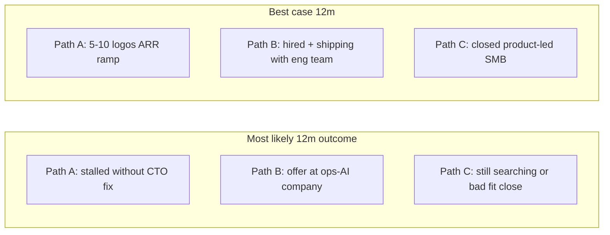

# 12-Month Path Comparison

Compare three paths on the same axes. Do not evaluate acquisition in isolation — your writings ([`fatalism.md`](../../REPENTANCE/fatalism.md), [`too-greedy.md`](../../REPENTANCE/too-greedy.md)) warn this is how relapse starts.

---

## Paths

| | Path A: Quotely / Moovez | Path B: Series-A/B ops-AI role | Path C: Owner-operator SMB acquisition |
|---|-------------------------|--------------------------------|----------------------------------------|
| **One-line** | Compound ARR on product you already built | Join team with 5+ engineers; own a metric | Buy cash-flow business; operate and improve |

---

## Comparison matrix

| Dimension | Path A | Path B | Path C |
|-----------|--------|--------|--------|
| **12-month upside** | $120K ARR / 10 operators (locked target); case study with verified ARR | $150–250K+ comp; one owned revenue/retention number; logo + team | SDE $150–400K business if acquired; equity build; operator credibility |
| **12-month realistic upside** | Low–medium unless CTO blocker breaks Q1 | Medium if lane held (50–80 cos, founder outreach) | Low in year 1 — search + close eats 6–12 mo; SDE upside year 2+ |
| **Capital required** | Time + distribution; minimal cash | None (income from day 1 post-hire) | $50–250K+ equity injection typical for SMB; SBA debt service |
| **Grind shape** | 50 sales conversations; weekly posts; stakeholder updates; anti-feature-factory backlog | Job search outbound + interviews + onboard; then PM grind | Listing review, IOI/LOI, diligence, seller transition, **daily operator** (payroll, vendors, staff) |
| **Identity fit** | Founding Product Lead (locked) | Founding / Principal / Head of AI Product | General manager + improver — only fits if product-led |
| **Breaks CTO blocker?** | Only if Q1 resolution (replace CTO, ship solo, or pivot to advisory) | **Yes** — primary reason per `too-greedy.md` | Only if you buy a business **with** technical team or low-tech ops |
| **Main failure mode** | Waiting while blocked; no ARR movement | Exit-driven hire; generic PM funnel; taking first offer | Analysis paralysis; wrong deal; trapped in low-leverage ops; domain drift |
| **Credibility output** | ARR + customer logos | Employer validation + owned metric | P&L ownership — **if** business scales and you hold 3+ years |
| **REPENTANCE alignment** | **Explicit 12-month plan** | Allowed if ARR path fails; same domain | **Conflicts** unless ops-AI adjacent + bounded + doesn't pause A/B |

---

## Expected value (qualitative, 12-month horizon)

| Path | Most likely (12 mo) | Best case (12 mo) | Worst case |
|------|---------------------|-------------------|------------|
| A | Blocked shipping; fractional distraction | ARR off zero; 10 operators path visible | Quit Moovez; narrative weakens |
| B | Long search; some screens; no offer | Hired at Series-A ops-AI; shipping | Wrong job; repeat in 18 mo |
| C | No close; time sunk in listings | Accretive acquisition in lane | Overpay; hate daily ops; debt stress |

**For the next 12 months, Path B has the highest expected credibility + income** if you execute the ops-AI GTM (founder outreach, 50–80 companies in `too-greedy.md`).

Path A has the highest **upside leverage** only if Q1 CTO resolution happens.

Path C has the **lowest 12-month EV** unless you already have capital, seller relationships, and a narrow archetype — none documented today.

---

## Opportunity cost

| If you choose C, you likely reduce | By |
|-------------------------------------|-----|
| Path B outbound volume | 5–10 hrs/week on listings/diligence → fewer founder conversations |
| Path A distribution | Same hours; Q2–Q4 sales motion in `too-greedy.md` never runs |
| Focus | Violates one-bet rule unless acquisition **replaces** A and B explicitly |

**Rule:** Path C is only rational if you **consciously retire** Path A or B for a defined window (e.g. 90-day acquisition sprint) with a kill date — not as a third parallel track.

---

## Decision pre-wire

| If this is true… | Favor… |
|------------------|--------|
| CTO blocker unresolved after Q1 | Path B (or C only if buy includes eng team) |
| Quotely hits 3+ paying operators with you shipping | Path A |
| You have $X equity + SBA pre-qual + 18mo runway | Re-score Path C |
| You dread sales but love spreadsheets on listings | Suspect relapse — favor Path B reps |

Fill `X` in [`operator_readiness_checklist.md`](operator_readiness_checklist.md).

---

## Summary

**Path C does not beat A/B on 12-month expected value with current evidence.** It may beat them on **year 3–5** if you buy right, operate through boredom, and stay in a product-leveraged niche — but that's a different decision than "right goal for the next 12 months."
