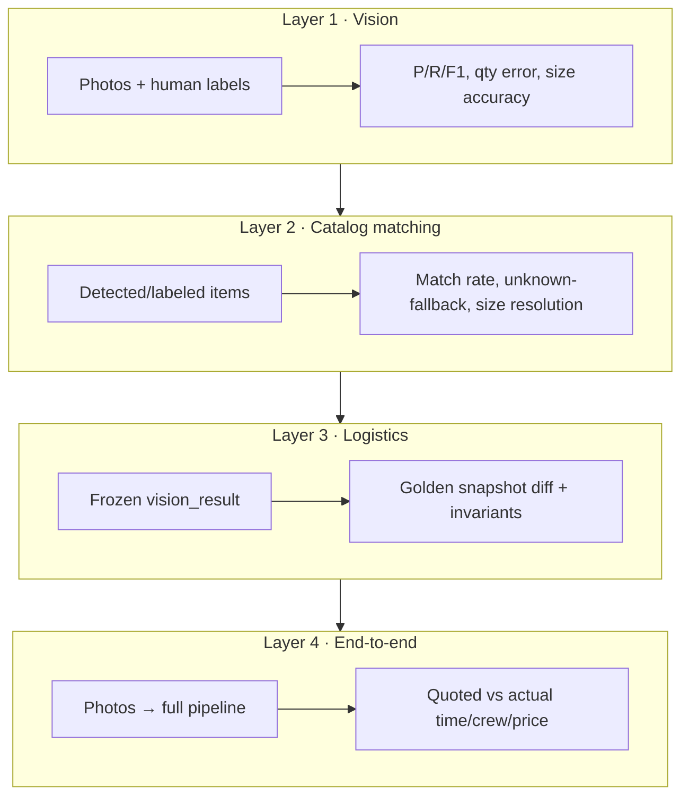

# Vision Agent Evals — Personal Guide

> **Purpose:** One place to understand how evaluation works (and is planned) for the Moovez Vision Agent.
> **Status:** Planning docs are written; most of the `evals/` harness is **not built yet**. Operational evals today run through the Streamlit UI and `tests/`.
> **Last updated:** 2026-07-18

---

## Quick orientation

The Vision Agent is a **two-layer system**. Eval it in two layers, not as one black box:

| Layer | What it does | Deterministic? | How to eval |
|-------|--------------|----------------|-------------|
| **Vision** | Gemini turns photos → item list (`name`, `qty`, `size`, `location`) | No | Statistical metrics (precision/recall, quantity error) |
| **Logistics** | Catalog enrichment + `MovingCalculator` → time, crew, price | Yes | Golden-file snapshot tests, invariants |

Mixing them (photo → price vs human quote) hides whether a miss came from vision or the calculator. Split first, compose second.

**Pipeline (Version 9):**

```
Media → analyze_media() [Gemini]
     → enrich_items() [catalog lookup]
     → compute_logistics() [calculator]
     → quote
```

Modules: `Version 9/Gemini/modules/ai_client.py`, `item_enrichment.py`, `calculator.py`.

---

## What “RAG” means here (and what it doesn’t)

**There is no vector RAG in this project** — no embeddings, chunking, or retrieval-augmented prompts.

What exists instead is **structured catalog retrieval**: detected item names are matched against a knowledge base to pull weight, volume, `baseTime`, and category. That is the eval plan’s **Layer 2 — Catalog matching**.

```
Gemini item name
    → enrich_items() / find_item_category()
    → JSON catalog | spreadsheet CSV | SQL VisionItems table
    → enriched item + calculationDebug.matching[]
```

**Match cascade** (`calculator.find_item_category`):

1. Exact category name
2. Alias substring match
3. `unknown/fallback` with default weight/volume/time

**Signals to eval** (from `calculationDebug.matching[]`):

| Signal | Field | Why it matters |
|--------|-------|----------------|
| Match rate | `1 − unknownFallbackCount / totalItems` | Low rate → thin catalog or bad vision names |
| Unknown-fallback leaderboard | `inputName` where `matchMethod == "unknown/fallback"` | Prioritize catalog additions |
| Size resolution | `selectedSize` vs labeled size | Non-standard sizes often fall through to `"medium"` |
| Match method mix | `% "alias"` vs `% "category"` | High alias-dependency = brittle naming |

**Triple-source comparison (built today):** `UI App/batch_test_runner.py` replays frozen vision and runs the same items through three catalog backends — **JSON**, **Spreadsheet**, **Database** — side by side in `Data/test_reports/batch testing result.csv`.

If you add true RAG later (e.g. semantic item lookup), treat it as a new Layer 2 variant with its own match-rate and latency metrics. The four-layer eval architecture still applies.

---

## The four eval layers



### Layer 1 — Vision detection (planned)

**Question:** Does Gemini see the right items in the right quantities?

**Ground truth:** Human-labeled inventories per image set (Dataset A — deprioritized until quote errors need item-level debugging).

**Headline metrics:**

- Item recall, precision, F1
- Quantity MAE on matched items
- Size accuracy (% correct size band)
- Cross-run consistency (std dev across N=5 runs)

**Item matching (detected ↔ truth):** exact canonical → alias/substring (reuse `find_item_category`) → optional LLM-as-judge fallback. Log judge usage — high rate means fix the catalog, not lean on the judge.

### Layer 2 — Catalog matching (partially operational)

**Question:** Given items (from Gemini or labels), do they map to the catalog correctly?

Deterministic, cheap, runs without Gemini. Already observable via `calculationDebug` in batch test output.

### Layer 3 — Logistics snapshots (highest ROI, not yet automated)

**Question:** Does the calculator produce the same time/crew/price for a frozen vision input?

**Method:**

1. Take `Data/test_moves/*/move.json` (14 frozen cases checked in)
2. Run `enrich_items()` + `calculate_total_logistics()` — **no API key**
3. Diff vs committed golden `evals/golden/<move_id>.json` (strip `taskDebug` UUIDs)
4. Assert invariants: crew bounds, truck sufficiency, monotonic pricing, phase sums, price range sanity

Existing regression scripts to fold in: `tests/verify_pricing.py`, `tests/test_pipeline_split.py`, `tests/test_elevator_fix.py`, etc.

### Layer 4 — End-to-end quote accuracy (partially operational)

**Question:** Photo → final quote vs real job outcomes.

**Ground truth priority:**

1. Real customer-reported actuals (production — see online eval below)
2. `Data/test_reports/batch testing result.csv` → **Real Job Result** column
3. Historic Jobs legacy JSON (weaker anchor)

**Metrics** (aligned with production accuracy tracking):

- Total-minutes MAE
- % within ±15%
- Crew mismatch rate
- Price-band hit rate (actual in min–max?)

Because vision is non-deterministic, run N=5 and report mean ± spread.

---

## Online vs offline evals

Two complementary halves — do not merge, do connect:

| | **Offline** (this repo) | **Online** (production) |
|---|-------------------------|-------------------------|
| Question | Is the agent correct *before* ship? | Was the quote right in the real world? |
| Ground truth | Labeled inventories + frozen outputs + CSV actuals | Customer-reported minutes/crew |
| Speed | Seconds–minutes (CI) | Weeks |
| Coverage | Every layer | End-to-end totals only |
| Runs in | Vision Agent repo | MoveasyBackend + Quotely Admin |

**Flywheel:** production drift → new offline cases → regression tests → fewer production failures.

The `calculationDebug` object is shared: assert against it offline, persist it on `QuoteRecord` online.

---

## Datasets

| Dataset | Path (planned) | Status | Use |
|---------|----------------|--------|-----|
| **A — Vision labels** | `evals/datasets/vision/*.jsonl` | Not built | P/R/F1 per photo set |
| **B — Logistics golden** | `evals/golden/*.json` | Not built | Snapshot diff for calculator |
| **C — Historic jobs** | `evals/datasets/historic_jobs.v1.jsonl` | Not built | Quote accuracy vs CSV actuals |

### What exists today

| Asset | Location | Notes |
|-------|----------|-------|
| Frozen moves | `Data/test_moves/` (14 folders) | Each has `move.json` + `preview_*.jpg` |
| Golden actuals | `Data/test_reports/batch testing result.csv` | Join on `name` ↔ column B `File name` |
| Original photos | `Historic Jobs/Example job */` | For full-pipeline reruns |
| Catalog | `Data/moving_items_logistics_v2.json` | Primary JSON knowledge base |
| Rules | `Data/moving_calculation_rules.json` | Stairs, elevator, pricing |

### Historic jobs schema (Dataset C)

Full spec: [`vision-agent-evals.md` §4.1](./vision-agent-evals.md#41-historic-jobs-dataset-schema-evalsdatasetshistoric_jobsv1jsonl).

**Join key:** `move.json` `"name"` = CSV column B (e.g. `"ex job 2"`).

**Headline metric set:** 9 **trusted** jobs — ex jobs 1–4, 8–9, 11–13. Exclude `guess`, `incomplete`, and `excluded` via `actuals_quality` / `include_in_headline_metrics`.

| `name` | Quality | In headline? |
|--------|---------|--------------|
| ex job 1–4 | trusted | yes |
| ex job 5 | guess | no |
| ex job 6–7, 10 | incomplete | no |
| ex job 8–9, 11–13 | trusted | yes |
| test move 123 | excluded | no |

---

## What’s built vs planned

| Capability | Status | Where |
|------------|--------|-------|
| Batch replay (no Gemini) | **Built** | `UI App/batch_test_runner.py` |
| Triple-source catalog compare | **Built** | JSON / Spreadsheet / Database columns in CSV |
| Frozen move fixtures | **Built** | `Data/test_moves/` |
| CSV golden actuals | **Built** | `batch testing result.csv` |
| Performance consistency (N runs) | **Built** | Streamlit “Run 5 iterations” in `UI App/app.py` |
| Calculator unit tests | **Partial** | `tests/*.py` |
| `evals/` harness package | **Planned** | See [`vision-agent-evals.md` §7](./vision-agent-evals.md#7-proposed-structure--tooling) |
| `historic_jobs.jsonl` generator | **Planned** | `evals.harness.build_historic_jobs` |
| Golden snapshot files | **Planned** | `evals/golden/` |
| Vision P/R/F1 automation | **Planned** | `evals/harness/vision_metrics.py` |
| LLM-as-judge matching | **Planned** | `evals/harness/judge.py` |
| CI gates | **Planned** | PR: logistics hard-fail; vision nightly |

---

## How to run evals today

### 1. Batch quote accuracy (primary)

```bash
cd "UI App"
streamlit run app.py
```

1. Open **Batch Testing**
2. Select saved moves from `Data/test_moves/`
3. **Run Batch Test** — replays frozen vision, no Gemini cost
4. Results append to `Data/test_reports/batch testing result.csv`
5. Compare **Real Job Result** vs **VA Ver. 9** / JSON / Spreadsheet / Database columns

Programmatic entry: `batch_test_runner.run_batch(analyzer, selected_folders, logistics_params)`.

### 2. Full pipeline with Gemini (vision + E2E)

Use **Analyze Move** in the Streamlit UI with historic photos or test move previews. Enable **Run 5 iterations** for consistency analysis → `performance_test_results.json`.

### 3. Calculator regression (command line)

```bash
python -m unittest tests/test_pipeline_split.py -v
python tests/test_elevator_fix.py
python tests/verify_pricing.py
python tests/verify_large_truck_logic.py
python tests/test_volume_crew_logic.py
```

### 4. SQL catalog connectivity

```bash
python test_vision_catalog_sql.py
```

### Planned commands (not yet available)

```bash
# Generate historic jobs dataset
python -m evals.harness.build_historic_jobs \
  --csv "Data/test_reports/batch testing result.csv" \
  --test-moves-dir Data/test_moves \
  --out evals/datasets/historic_jobs.v1.jsonl

# Fast CI — deterministic layers only
pytest evals/tests/ -m "logistics or matching or invariants"

# Full run with Gemini
python -m evals.harness.runner --layers vision,e2e --repeats 5

# Re-bless golden files after intended calculator change
python -m evals.harness.runner --layers logistics --update-golden
```

---

## Planned `evals/` layout

```
evals/
├── README.md
├── requirements-eval.txt
├── datasets/
│   ├── historic_jobs.v1.jsonl      # Dataset C
│   └── vision/*.jsonl              # Dataset A (later)
├── golden/*.json                   # Dataset B
├── harness/
│   ├── runner.py
│   ├── vision_metrics.py
│   ├── logistics_snapshot.py
│   ├── matching_metrics.py
│   ├── judge.py
│   └── report.py
├── invariants/
├── tests/
└── results/                        # gitignored run outputs
```

**Design rules:**

- Import production code (`enrich_items`, `MovingCalculator`) — never reimplement in eval
- No Gemini for Layers 2–3 (free, every PR)
- Gemini for Layers 1 & 4 on schedule or pre-release only
- One report format: console table + JSON (+ Markdown/HTML)

---

## CI gates (planned)

| Trigger | Layers | Gate |
|---------|--------|------|
| Every PR | Logistics snapshot, matching, invariants | Hard fail on diff or invariant break |
| PR touching `ai_client.py` / prompt | + 2–3 vision smoke cases (N=1) | Warn only (cost + variance) |
| Nightly | Full vision (N=5), E2E | Alert if regression > ε vs 7-day baseline |
| Pre-release | Everything + holdout | Sign-off checklist |

Thresholds start **observe-only**, then become gates once baselines exist.

---

## Metrics cheat sheet

| Layer | Metric | Gate style |
|-------|--------|------------|
| Vision | F1, recall, precision | Threshold (e.g. recall ≥ 0.85) |
| Vision | Quantity MAE | Threshold |
| Vision | Cross-run std | Trend alert |
| Matching | Catalog match rate | Threshold (≥ 0.9) |
| Matching | Unknown-fallback leaderboard | Diagnostic |
| Logistics | Snapshot equality | Exact (or re-bless) |
| Logistics | Invariants | Exact |
| E2E | Minutes MAE, ±15%, crew match, price in band | Threshold |

Per-run output (planned): `evals/results/<run_id>/<job_key>.json` with `quoted` and `errors` blocks.

---

## Implementation roadmap

| Phase | Focus | Effort |
|-------|-------|--------|
| **0** | Golden snapshots + invariants + CI hard gate | Days |
| **1** | Vision labels + P/R/F1 (Dataset A) | 1–2 weeks |
| **2** | Matching metrics + optional LLM judge | Days |
| **3** | Historic jobs JSONL + E2E harness + ML Ops dashboards | Ongoing |
| **4** | Scale to 100+ cases, nightly trends, holdout | Ongoing |

Checklist: [`vision-agent-evals.md` §11](./vision-agent-evals.md#11-implementation-checklist).

---

## Source documents

| Doc | Role |
|-----|------|
| [`vision-agent-evals.md`](./vision-agent-evals.md) | **Primary spec** — four layers, datasets, schemas, CI, roadmap |
| [`evals-system-design-9f8329.md`](./evals-system-design-9f8329.md) | **Companion design** — modular package layout, performance evals, CLI ideas |

This README is the condensed map. Use the two specs for field-level schemas, example JSONL records, and implementation detail.

---

## Suggested first steps

1. **Quote accuracy now:** Open `batch testing result.csv`, filter to 9 trusted jobs, compare Real Job Result vs latest batch columns.
2. **Freeze the calculator:** Replay `move.json` files through enrichment + logistics (pattern in `batch_test_runner`) and diff outputs — this becomes Layer 3 golden files.
3. **Build Dataset C:** Run the planned `build_historic_jobs` script to materialize `historic_jobs.v1.jsonl` from CSV + `move.json`.
4. **Catalog gaps:** Sort `calculationDebug.matching` unknown-fallback items from a batch run — fastest path to better quotes without touching Gemini.

---

## Open questions / gaps

- No `quote-accuracy-tracking.md` in this repo yet (referenced by the eval plan for online metrics).
- No `evals/` Python package — all automation is manual UI + ad-hoc scripts.
- Vision ground-truth labeling (Dataset A) is explicitly deprioritized until item-level debugging is needed.
- True vector RAG is out of scope today; catalog matching is the retrieval layer to eval.

If you want this guide extended (e.g. step-by-step CSV join examples, a single-job walkthrough, or a template for labeling Dataset A), say which section to deepen.
