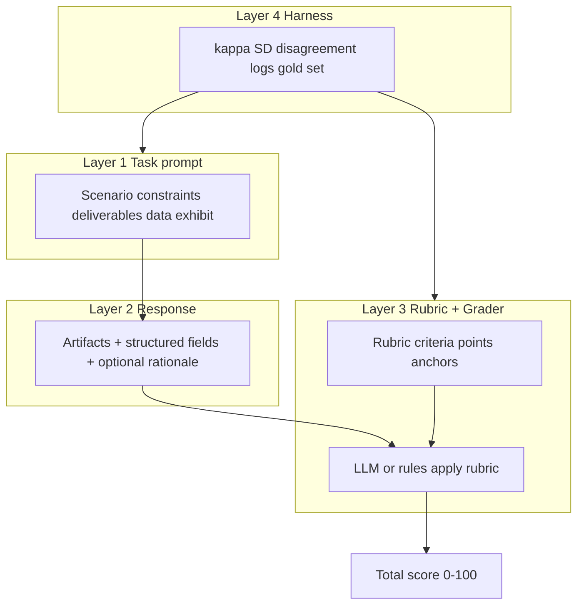

# Study Roadmap: AI Evals, Rubric Engineering, and Harness Design (Expanded)

This plan is a **self-contained study guide**. Your file [`rawdeal.md`](rawdeal.md) stops at line 176 (Exhibit D header only; Sections 1-4 are navigation labels with no body). **Part 6** reconstructs Exhibit D and gives full templates for Sections 1-4 so you can practice the complete case.

---

## Part 1: What the case is about (plain language)

### The fictional company

**WorkflowIQ** sells B2B software to enterprises (Fortune 500 HR teams, consulting firms). Clients use it to **assess PM candidates** with realistic simulations: candidates perform tasks in fake versions of Calendar, Gmail, Mixpanel, Slack, etc., and get a score.

Your role in the case: **Senior PM on the "AI Task & Prompt Design" team**. You do not code the platform. You design:

1. The **candidate-facing task** (what the PM applicant sees and does)
2. The **scoring rubric** (how responses get points)
3. The **rationale** for why your design fixes known problems

### The product failure (why they hired you to fix it)

The existing **Multi-Tool PM Assessment** track is popular (41 clients, 2,047 candidates in 90 days) but **broken as a measurement instrument**:

| Symptom | Metric | What it means in plain English |
|---------|--------|--------------------------------|
| Scores pile up in the middle | Mean 67, **SD 8.3** | Almost everyone gets ~67-71; hiring managers cannot rank candidates |
| AI grader disagrees with humans | **Kappa 0.58** (want >= 0.75) | When a human scores a response, the LLM auto-grader often disagrees |
| Long answers get free points | **45% over-award** on verbose shallow text | The judge rewards length and fluency, not rubric criteria |
| Tasks feel real but easy | Realism 4.1/5, challenge 2.8/5 | Surface realism without intellectual difficulty |

**Business stakes:** 3 clients ($1.2M ARR) will churn in **60 days** unless discrimination and grading reliability improve.

### Your assignment: "Workflow Orchestration Challenge"

Design a **new** 30-minute module where a mid/senior PM candidate must orchestrate work across **Google Calendar, Gmail, Mixpanel, and Slack** in one integrated scenario.

**Hard requirements from the brief:**

- Completable in **30 minutes**
- At least one **Mixpanel / quantitative** component
- At least one **artifact** (Slack message, email, calendar invite with agenda, etc.)
- Auto-grader **kappa >= 0.75**
- **Discriminate** 50th vs 90th percentile candidates (wider score spread than SD 8.3)

### What the case is really testing (meta)

The rubric at the top of `rawdeal.md` (Analytical Rigor, Strategic Thinking, etc.) scores **your written case answer**, not the candidate. Strong candidates for the job demonstrate they can think like:

- A **PM** (tradeoffs, delivery plan, client risk)
- A **prompt engineer** (clear task spec, grader-safe language)
- A **psychometrician-lite** (reliability, discrimination, calibration)

### How this maps to your goals

| You want to learn | This case teaches |
|-------------------|-------------------|
| Prompt engineering | Candidate task prompt + auto-grader prompt |
| Context engineering | What goes in the grader's window (rubric, exemplars, response, data exhibit, anti-bias rules) |
| Harness engineering | 4-stage pipeline, metrics, calibration loop, versioning |

Same pattern as **RES**: JD + master_context -> LLM generates resume -> linters/review judge quality -> you want reliable, measurable outputs.

---

## Part 2: The four-layer harness (core mental model)



### Layer 1: Task prompt (prompt engineering)

**Job:** Tell the candidate exactly what situation they are in, what to produce, and what constraints apply.

**Good task properties:**

- **One coherent story** (e.g. activation drop after launch, not "use four tools")
- **Compounding steps** (Mixpanel insight -> decision -> comms -> calendar)
- **Bounded time** (30 min) with enough work for strong candidates to use ~28 min (Exhibit C)
- **Forces tradeoff** (speed vs quality, two stakeholders disagree, metric ambiguous)

**Bad task (case warns against):** "Schedule a meeting, send an email, check Mixpanel, post in Slack" with no dependency between steps.

### Layer 2: Response shape (context engineering for grading)

**Job:** Make responses **gradable**. Structure is a feature, not bureaucracy.

| Response type | Grading ease | Example |
|---------------|--------------|---------|
| Multiple choice / select | Easiest (97% agreement in Exhibit B) | "Primary root cause: A/B/C/D" |
| Checklist fields | Easy | "Named stakeholders: [ ] Eng [ ] Data [ ] GTM" |
| Template fill-in | Easy | Slack message with required @mentions |
| Short bounded text | Medium | Max 150 words; must cite 2 metrics |
| Open "strategy rationale" | Hard (67% of disagreements) | "Explain your thinking" unlimited |

**Design tactic:** Push complexity into **decisions**, not into **unstructured prose**.

### Layer 3: Rubric + grader (rubric engineering + grader prompt)

**Rubric** = contract between humans and machines.

Each criterion should have:

- **ID** (C1, C2, ...)
- **Points** (weights sum to 100)
- **Observable definition** (what exactly counts)
- **Partial credit rules** (0 / 1 / 2 points with anchors)
- **Anti-gaming** (max words, required elements, penalty for missing data cite)

**Grader prompt** (context engineering) typically includes:

1. Role: strict grader, no sympathy, no length bias
2. Full rubric (table or JSON)
3. Candidate response + any tool outputs
4. Same **data exhibit** candidate saw (Mixpanel table)
5. 2-3 **calibration exemplars** (scored examples)
6. Output format: per-criterion scores + short evidence quotes

### Layer 4: Harness (measurement + iteration)

**Job:** Know if the system works before clients churn.

| Metric | Question it answers |
|--------|---------------------|
| **SD of total score** | Do we spread candidates out? |
| **Kappa (per criterion or banded total)** | Do humans and LLM agree? |
| **Disagreement taxonomy** | Which criteria break? (like Exhibit B) |
| **Over-award rate** | Does verbosity still fool the judge? |
| **Time-on-task vs score (r)** | Is effort correlated with quality? |
| **Pilot n** | Do we have enough data to trust kappa? |

**4-stage pipeline** (from background):

1. Scenario design
2. Prompt spec and rubric authoring
3. LLM auto-grader calibration
4. Human rater validation

Your Section 4 delivery plan should map work into these stages across 60 days.

---

## Part 3: Concept deep-dives (read slowly, do exercises after each)

### A. Score discrimination and standard deviation

**Discrimination** = can the test tell apart weaker and stronger performers?

**Standard deviation (SD)** = typical distance of scores from the mean.

- Mean 67, SD 8.3 -> about 68% of scores fall in 59-75 if roughly normal
- **IQR** in Exhibit A: 25th pct 61, 75th pct 73 -> only 12 points between quartiles
- Middle 60% in **62-71** -> 9-point band holds most candidates

**Why SD matters for hiring:**

If two candidates score 68 and 70, that difference is **noise**, not signal. Hiring managers said those candidates are "indistinguishable."

**How to increase SD (design levers):**

1. **Harder task** -> weak candidates miss more criteria (floor effect breaks)
2. **Rubric with more tiers** on hard criteria (0/1/2/3 instead of pass/fail only everywhere)
3. **Weight criteria** that top candidates actually do differently (Mixpanel diagnosis, correct stakeholder tradeoff)
4. **Ceiling removal** -> only 4% above 85 today; strong answers should reach 85-95 when deserved

**Target intuition for new module:** SD might aim for **12-15+** on 100-point scale (case "Strong" tier implies you should propose realistic pilot targets).

**Correlation reminder (Exhibit C):** Time-on-task **r = 0.41** with score. Time helps but does not fully explain performance. Do not use duration as sole proxy for quality (gaming risk: slow vague answers).

---

### B. Cohen's kappa (human vs AI agreement)

**Problem kappa solves:** Raw agreement is misleading.

Example: 90% of responses are "Pass." Two raters guessing "Pass" always would agree often **by luck**.

**Cohen's kappa:**

```
kappa = (Po - Pe) / (1 - Pe)

Po = observed agreement (fraction of items where human and AI match)
Pe = expected agreement by chance given marginal rates
```

| Kappa | Rough interpretation |
|-------|------------------------|
| < 0.20 | Slight |
| 0.21-0.40 | Fair |
| 0.41-0.60 | Moderate (case: **0.58**) |
| 0.61-0.80 | Substantial (case **target: 0.75+**) |
| 0.81-1.00 | Almost perfect |

**Case numbers:** 0.58 today vs >= 0.75 target -> auto-grader is **not trustworthy** for high-stakes hiring without redesign.

#### Prevalence paradox (your correct intuition)

If 95% of ratings are "Meets standard," even high raw agreement can yield **low kappa** because chance agreement is already high.

**When kappa is misleading:**

- Imbalanced categories (almost all pass or all fail)
- Rare categories
- Comparing kappa across studies with different prevalence

**Alternatives to explore (names only for further reading):**

- **Percent agreement** (simple but ignores chance)
- **Scott's pi** (similar to kappa, different chance model)
- **Gwet's AC1** (often more stable under skewed prevalence)

**Practical approach for LLM evals:**

- Compute **kappa per criterion** (binary: met / not met)
- Flag criteria with kappa < 0.6 for rubric rewrite
- For **total score**, also track **MAE** or **Pearson r** between human and AI points (different question than agreement on labels)

#### Worked mini-example (Exercise 4 prep)

Human vs AI on 100 responses, criterion "Named both stakeholders":

|  | AI: Yes | AI: No |
|--|--------|--------|
| Human: Yes | 70 | 8 |
| Human: No | 12 | 10 |

- Po = (70+10)/100 = 0.80
- Compute Pe from row/column marginals (homework in Phase 1)
- kappa = (0.80 - Pe) / (1 - Pe)

If Pe is 0.72, kappa = 0.08/0.28 = **0.29** (poor) despite 80% agreement.

---

### C. Observable vs subjective rubric criteria (Exhibit B)

**Subjective criteria** use adjectives a rater must interpret:

- "Strong," "clear," "thoughtful," "demonstrates understanding"

**Observable criteria** reference checkable facts in the response:

- "Includes >= 3 metrics from Exhibit 2"
- "Names @data-lead and @eng-lead in Slack message"
- "Recommends Option A or B explicitly"

**Exhibit B data:**

- **67%** of 412 disagreements on subjective text fields
- **11%** on observable output fields
- **97%** agreement on select/rating fields

**Translation:** For auto-grading, **structure the task** so the hard parts are observable.

**Subjective-to-observable rewrite pattern:**

| Before (subjective) | After (observable) |
|---------------------|-------------------|
| Strong analysis | Cites >= 2 metrics; states direction of change; gives one cause hypothesis |
| Clear communication | <= 120 words; includes decision verb (ship/hold/rollback); lists owner |
| Thoughtful tradeoff | Names cost of Option A and Option B each in one bullet |
| Demonstrates PM judgment | Chooses one option; ties to metric; identifies one risk |

**Partial credit example (Criterion: Mixpanel diagnosis, 0-4 points):**

- 0: No metrics cited or wrong funnel
- 1: One metric, no week-over-week comparison
- 2: Two metrics, comparison stated, no recommendation
- 3: Two metrics + recommendation, risk not stated
- 4: Two metrics + recommendation + named stakeholder conflict + risk

---

### D. Verbosity bias and LLM-as-judge failure modes

**Case fact:** Auto-grader over-awarded **45%** of the time on verbose but shallow responses.

**Why LLMs do this:**

- Training data correlates length with quality
- Fluency feels like competence
- Rubric says "strong thinking" -> model fills gaps charitably

**Mitigations (use several):**

1. **Word caps** on free-text fields (e.g. strategy rationale max 150 words)
2. **Required slots** (must fill: Metric 1, Metric 2, Decision, Risk)
3. **Evidence quoting** in grader prompt: "Quote exact phrase from response before awarding each point"
4. **Negative exemplar** in grader context: long fluffy answer that scores 0
5. **Positive exemplar**: short answer that scores full points
6. **Explicit rule:** "Do not award points for tone, politeness, or length"
7. **Structured output first**, prose last (grade structure before narrative)

**Other LLM-judge biases** (general literature, not in case):

- **Position bias** (prefers first option)
- **Self-preference** (prefers own style)
- **Authority bias** (sounds confident -> higher score)

---

### E. Prompt engineering vs context engineering vs harness engineering

| Discipline | What you control | WorkflowIQ example | RES example |
|------------|------------------|--------------------|-------------|
| **Prompt engineering** | Instructions, tone, output format | Candidate task wording; grader "you are strict" | `mission_statement.md`, `skills_statements.md` |
| **Context engineering** | What documents/data appear in the window, order, size | Rubric + Mixpanel exhibit + exemplars in grader call | `master_context.md` + JD + `required_tools` in user block |
| **Harness engineering** | Pipeline, metrics, versioning, calibration, logging | 4-stage ship process; kappa/SD dashboards | `prompt_runs.csv`, linters, bundle hash (planned) |

**Rule of thumb:** Prompt = what to do. Context = what to read while doing it. Harness = how you know it worked in production.

---

## Part 4: Reconstructed Exhibit D (study material; not in source file)

> **Label:** Inferred from case stakes and typical PM assessment tradeoffs. Use for practice, not as "official" exam data.

### EXHIBIT D: STAKEHOLDER PRIORITIES (reconstructed)

| Stakeholder | Priority (rank) | Quote / concern | Implication for your design |
|-------------|-----------------|-----------------|---------------------------|
| **VP Product** | 1. Kappa >= 0.75 in 60 days | "We cannot sell auto-grading if clients do not trust scores." | Invest heavily in Stage 3 calibration; narrow rubric before launch |
| **VP Product** | 2. Stop churn ($1.2M ARR) | "FAANG and top-5 consulting will leave." | Pilot with those 3 accounts first; involve them in rubric review |
| **Enterprise CS** | 1. Realism preserved | "Do not make it feel like a coding test." | Keep Calendar/Gmail/Slack artifacts realistic |
| **Enterprise CS** | 2. Fair time budget | "Candidates complain when tasks run over." | Design for 28 min strong / 30 min cap; avoid hidden steps |
| **Prompt Engineering lead** | 1. Observable criteria | "Subjective fields break the judge every time." | Minimize free text; JSON or form fields where possible |
| **Psychometrician** | 1. Discrimination | "SD 8.3 is unacceptable for rank ordering." | Weight hard criteria; pilot check SD on 200 responses |
| **Psychometrician** | 2. Validity | "Score must correlate with hiring manager interview outcome." | Optional: recommend follow-up validation study (out of 60-day scope) |
| **Sales** | 1. Ship flagship module Q2 | "We need a demo for pipeline." | MVP module in 45 days with limited client beta; polish in 60 |
| **Candidates (feedback)** | 1. Intellectual challenge | 2.8/5 challenge vs 4.1/5 realism | Add analytical tension; avoid busywork tool tour |

**Forced tradeoffs for Section 4:**

- **Speed vs calibration depth:** 60 days is tight for 4-stage pipeline on flagship quality
- **Discrimination vs time:** Harder tasks may push completion > 30 min for some
- **Automation vs human review:** May need human adjudication on borderline cases until kappa stable
- **Scope:** Full 4-tool orchestration required by brief vs pilot with 2 tools first (de-scope argument must be careful)

---

## Part 5: Sections 1-4 — full templates (what to write for the case)

Use exhibits A-D + background. Cite numbers. Each section below is a **study template** with outline, example bullets, and self-check rubric.

---

### Section 1: Situation Analysis (diagnosis only, no solution yet)

**Purpose:** Prove you understand **why** the current track fails before proposing fixes.

**Recommended structure (1.5-2 pages):**

#### 1.1 Executive summary (3-4 sentences)

- Two failures: low discrimination (SD 8.3) and low human-AI agreement (kappa 0.58)
- Business impact: $1.2M ARR at risk, 60-day deadline
- Root cause thesis in one line (e.g. "Subjective rubric + undemanding task -> score compression and judge drift")

#### 1.2 Symptom -> evidence -> root cause table

| Symptom | Evidence (exhibit) | Root cause |
|---------|-------------------|------------|
| Hiring cannot separate candidates | A: middle 60% score 62-71; SD 8.3 | Ceiling/floor compression; task does not stress different skills |
| Low challenge | Candidate rating 2.8/5 | Task is realistic but not analytically demanding |
| Human-AI mismatch | Kappa 0.58; B: 67% disagreements on subjective fields | Rubric not operationalized for LLM |
| Verbose fluff rewarded | 45% over-award | Grader prompt/rubric rewards proxy features |
| Fast finishers score low-ish | C: bottom Q 16.7 min, r=0.41 | Task may be completable without deep work |

#### 1.3 Interaction effects (strong / excellent tier)

Example insights to argue:

- **Low discrimination masks kappa work:** When everyone scores 67-71, small rubric disagreements change ranks randomly
- **Time-on-task is insufficient anti-gaming alone:** Slow answers can still be shallow; need observable anchors
- **Realism without difficulty** -> clients happy on surface, unhappy on hiring signal

#### 1.4 What you are NOT solving in 60 days (scope boundary)

- Predictive validity study vs on-the-job performance (longitudinal)
- Rebuilding entire platform
- Replacing human review entirely on day 1

**Self-check (Section 1):**

- [ ] Cited SD, kappa, 45%, 62-71 band, 67%/11% disagreement split
- [ ] Did not jump to solution details yet
- [ ] Named at least one interaction between exhibits

---

### Section 2: Task Prompt Design (candidate-facing spec)

**Purpose:** Production-ready prompt a candidate would see in the simulation.

**Template outline:**

```markdown
## Workflow Orchestration Challenge (30 minutes)

### Context
[Company name, product, incident: e.g. B2B SaaS, Week 2 after feature launch, activation down 18% WoW]

### Your role
PM, Growth + Platform liaison

### Tools available (simulated)
Google Calendar, Gmail, Mixpanel (Exhibit 2 attached), Slack

### Situation
[4-6 sentences: conflicting signals from Eng vs Data, executive asks for plan by EOD]

### Your deliverables (submit all)
1. Mixpanel: answer Q1-Q3 (structured form)
2. Slack: message to #launch-war-room (template)
3. Email: summary to VP Product (max 200 words)
4. Calendar: 30-min decision meeting invite with agenda (3 agenda items min)

### Constraints
- 30 minutes total
- Use only data from Exhibit 2 for quantitative claims
- You must recommend exactly one primary action: (A) rollback (B) iterate (C) hold

### Exhibit 2: Mixpanel snapshot
[Small table: activation rate, D1 retention, funnel step conversion, WoW deltas]

### Evaluation notice (optional transparency)
Responses graded on specific criteria; vague strategy text without data will not score.
```

**Design checklist (map to case requirements):**

- [ ] All 4 tools used in **one** narrative chain
- [ ] Mixpanel quantitative component with **fixed exhibit** (same data for all -> fair grading)
- [ ] >= 1 artifact with **template** (gradable)
- [ ] Completable in 30 min (pilot with 3 internal PMs timing)
- [ ] 50th vs 90th percentile separation: weak miss metrics; strong nail tradeoff + comms

**Example scenario hook (study):** "Activation dropped 14% WoW after onboarding redesign. Eng says fix is technical debt; Data says messaging mismatch. CEO wants a decision memo before tomorrow's board prep."

**Anti-patterns to avoid:**

- Tool tour with no decision
- Unlimited essay "explain your approach"
- Ambiguous data exhibit (too many charts)

---

### Section 3: Rubric Architecture (auto-grader-ready)

**Purpose:** Criteria a prompt engineer can implement in code tomorrow.

**Recommended format:** Table with 8-12 criteria, 100 points total.

| ID | Criterion | Pts | Observable definition | 0 | 1 | 2 (if applicable) |
|----|-----------|-----|----------------------|---|---|---|
| C1 | Mixpanel: cites activation metric from exhibit | 10 | Exact metric name + WoW % | Missing | One of two | Both activation + retention |
| C2 | Mixpanel: correct direction of change | 10 | States increase/decrease correctly | Wrong | Partial | Correct |
| C3 | Decision: selects A, B, or C | 15 | Exactly one primary action | None / multiple | - | Clear single choice |
| C4 | Decision: justification cites 2+ metrics | 15 | Count metrics from exhibit | 0-1 metric | - | 2+ |
| C5 | Slack: tags both @data-lead and @eng-lead | 10 | Handles in message | 0 | 1 | - |
| C6 | Slack: states decision and asks for reply by time | 10 | Explicit | No | Yes | - |
| C7 | Email: <= 200 words | 5 | Word count | Over | Within | - |
| C8 | Email: includes risk of chosen option | 10 | One risk bullet | No | Yes | - |
| C9 | Calendar: invite 30 min with 3 agenda items | 10 | Count agenda bullets | <3 | 3+ | - |
| C10 | Calendar: agenda includes decision review | 5 | Keyword / structure | No | Yes | - |
| C11 | Cross-tool consistency: same decision everywhere | 10 | Slack/email/calendar align | Conflict | Partial | Consistent |

**Partial credit policy (write explicitly):**

- "Sum criterion points; no holistic bonus."
- "Holistic 'strategy' field removed."

**Anti-gaming block:**

- Max 150 words on optional rationale field; not scored if exceeds
- Grader must quote evidence per criterion

**Grader output schema (JSON):**

```json
{
  "criterion_scores": {"C1": 2, "C2": 2, ...},
  "total": 84,
  "evidence": {"C1": "Quoted: activation 41% (-14% WoW)"}
}
```

**Self-check (Section 3):**

- [ ] No "strong," "clear," "thoughtful" without observable definition
- [ ] Weights sum to 100
- [ ] >= 70% of points on observable / structured criteria
- [ ] Pilot target: per-criterion kappa >= 0.75 on n>=50 gold responses

---

### Section 4: Strategic Recommendation and Risk Assessment

**Purpose:** 60-day plan, metrics, risks, de-scope — use reconstructed Exhibit D.

**Recommended structure:**

#### 4.1 Recommendation summary

- Ship **Workflow Orchestration Challenge** as flagship replacement module for new hires on Multi-Tool track
- Prioritize **rubric observability** before **task flair**
- Beta with 3 at-risk clients weeks 5-6

#### 4.2 60-day timeline (map to 4-stage pipeline)

| Week | Stage | Activities | Exit criteria |
|------|-------|------------|---------------|
| 1-2 | 1 Scenario | Draft task; internal playtests (n=5); time timing | 80% finish <= 30 min; spread in blind human rank |
| 3-4 | 2 Rubric | Author rubric v1; legal review client-facing copy | No subjective-only criteria > 15% of points |
| 5-6 | 3 Calibration | Gold set 120 responses; tune grader prompt | Kappa >= 0.70 on holdout 40 |
| 7-8 | 3-4 | Iterate rubric; second gold batch | Kappa >= 0.75; SD >= 12 |
| 9 | 4 Human validation | Double human score 10%; disagreement review | Disagreement taxonomy trending down |
| 10 | Launch | Beta 3 clients; monitor | CSAT; no churn |

#### 4.3 Success metrics (quantitative)

| Metric | Current | Pilot target | How measured |
|--------|---------|--------------|--------------|
| Kappa | 0.58 | >= 0.75 | Per-criterion + banded total |
| SD | 8.3 | >= 12 | Last 200 candidates |
| Over-award verbose | 45% | < 15% | Audit sample 50 |
| Client churn (at-risk) | 3 accounts | 0 renew cancel | CS pipeline |

#### 4.4 Risks and mitigations

| Risk | Likelihood | Impact | Mitigation |
|------|------------|--------|------------|
| Kappa target missed at week 6 | Medium | High | Pre-planned rubric v2; add structured fields |
| Task too long | Medium | Medium | Cut optional fields; pilot timing |
| Clients reject harder task | Low | High | Position as "hiring signal"; exec webinar |
| Sales demos before calibrated | Medium | Medium | Demo uses pre-scored exemplar only |

#### 4.5 De-scope options (if deadline slips)

- Launch with **human adjudication** on C3-C4 until kappa stable
- **Reduce** rubric to 8 criteria for v1
- **Do not** de-scope four-tool requirement without VP approval (brief constraint)

#### 4.6 Confidence assessment

- High confidence: fixing subjective rubric improves kappa (Exhibit B)
- Medium confidence: SD >= 12 achievable in one module iteration
- Low confidence: 60 days enough for full predictive validity proof

**Self-check (Section 4):**

- [ ] Every week maps to pipeline stage
- [ ] Numeric targets stated
- [ ] Tradeoffs reference Exhibit D stakeholders
- [ ] Credible de-scope, not wishful thinking

---

## Part 6: Study phases and exercises (detailed)

### Phase 0: Orientation (1-2 hours)

**Read:** Part 1-2 of this plan.

**Do:** Draw the four layers for **RES** on paper:

- Layer 1: Which file is the "task prompt" to the LLM?
- Layer 2: What is the "response"?
- Layer 3: What judges it (linters, quality_review, ATS)?
- Layer 4: What metrics exist today vs missing?

**Done when:** You can explain the case in 2 minutes to someone else.

---

### Phase 1: Metrics literacy (3-4 hours)

**Read:** Part 3 sections A, B, C.

**Exercise 4 (detailed): Kappa by hand**

1. Create a 2x2 table: Human Pass/Fail vs AI Pass/Fail on 50 fictional scripts
2. Compute Po
3. Compute Pe = (marginal Human Pass * marginal AI Pass) + (marginal Human Fail * marginal AI Fail) for binary case
4. Compute kappa
5. Repeat when 90% are Pass -> watch kappa drop while Po stays high

**Exercise 4b: SD intuition**

- Generate 20 fake scores: ten at 68-71, ten spread 55-90
- Calculate mean and SD for each set
- Which set helps hiring more?

**Flashcard prompts:**

- What does SD 8.3 mean for a 100-point test?
- Why is kappa 0.58 bad for selling auto-grade?
- What is prevalence paradox?

---

### Phase 2: Rubric surgery (2-3 hours)

**Exercise 1 (detailed): Rewrite 5 subjective lines**

From case + your own experience, rewrite:

1. "Demonstrates strong thinking"
2. "Clear communication"
3. "Shows leadership"
4. "Good product sense"
5. "Thoughtful tradeoff"

For each: 2-3 observable criteria + point split.

**Exercise 1b: Rubric audit**

Take [`RES/prompts/resume_quality_review.md`](RES/prompts/resume_quality_review.md). Highlight every subjective adjective. Score each line: Red (not auto-grade safe) / Yellow / Green.

**Deliverable:** One-page "subjective -> observable" cheat sheet you keep at your desk.

---

### Phase 3: Task + grader design (4-5 hours)

**Exercise 2 (detailed): Mini task (15 min, 2 tools)**

Scenario: Slack + Mixpanel only. Incident: checkout drop 20%. Deliverables: 3 multiple-choice Mixpanel Qs + 1 Slack message template. Write full candidate prompt.

**Exercise 3 (detailed): Grader system prompt**

Structure:

```
SYSTEM:
You are a strict rubric grader...

RUBRIC:
(table)

CALIBRATION EXAMPLE HIGH:
(response + per-criterion scores)

CALIBRATION EXAMPLE LOW:
(response + per-criterion scores)

RULES:
- Quote evidence
- Ignore length and tone
...

USER:
Candidate response:
{{response}}
```

**Then:** Write full **Section 2** and **Section 3** for WorkflowIQ (use templates in Part 5).

**Peer review checklist:** Swap with future self in 24h; grade against case rubric at top of rawdeal.md.

---

### Phase 4: Full case write-up (4-6 hours)

**Write Section 1** using Part 5 template.

**Write Section 4** using reconstructed Exhibit D.

**Optional:** Combine into one doc as if submitting take-home.

**Grade yourself** using the case's 5 dimensions (Analytical Rigor 25%, etc.).

Target: "Strong" on each dimension per rawdeal.md descriptors.

---

### Phase 5: Apply to your work (2-3 hours)

**Exercise 5 (detailed): RES harness upgrade proposal**

Document (no code required unless you switch to Agent mode):

1. **Inventory** each quality gate in RES (file + observable Y/N)
2. **Propose** structured JSON schema for `resume_quality_review` output
3. **Define** gold set: 20 resumes, human labels per criterion
4. **Define** metrics: edit rate (user changed mission/skills), lint fail rate, optional kappa if human re-scores
5. **Map** to planned `prompt_observability` fields

**Connection to your HRIS portfolio:** Same observability pattern as grading a case study — criteria, evidence, agreement.

---

### Phase 6: Optional reading (ongoing)

| Resource | Focus | Time |
|----------|-------|------|
| Cohen (1960) kappa | Foundation | 30 min |
| Zheng et al. LLM-as-a-Judge | Biases | 1 hr |
| OpenAI Evals docs/repo | Harness patterns | 2 hr |
| Classical test theory primer | Validity/reliability vocabulary | 1 hr |

**After reading:** Write 3 failure modes you have seen when using LLMs to judge text.

---

## Part 7: Glossary (quick reference)

| Term | One-line definition |
|------|---------------------|
| **Discrimination** | Test spreads scores so hiring can rank candidates |
| **SD** | Spread of scores around mean; low SD = clustering |
| **Kappa** | Agreement beyond chance between two raters |
| **Po** | Observed agreement rate |
| **Pe** | Expected agreement by chance |
| **Prevalence paradox** | Kappa low despite high agreement when one label dominates |
| **Observable criterion** | Can verify from text without judgment adjectives |
| **Gold set** | Human-labeled responses used to calibrate judge |
| **Calibration** | Tuning grader until it matches humans on gold set |
| **Over-award** | Judge gives points criteria do not support |
| **Harness** | End-to-end eval system: prompt, rubric, judge, metrics, loop |
| **Auto-grader** | LLM (or rules) applying rubric at scale |
| **Validity** | Does the score measure what you claim (hard, long-term) |
| **Reliability** | Consistent scores across raters/attempts (kappa, SD) |

---

## Part 8: How you know you are "case ready"

You are at **foundation** when you can explain kappa, SD, Exhibit B, and 45% over-award without notes.

You are at **design** when you have written Section 2 + 3 that a prompt engineer could implement.

You are at **harness** when Section 4 includes numeric targets, 60-day stages, and risk de-scope.

You are at **apply** when you have redesigned one RES quality gate using observable criteria.

---

## Source file status

| Item | In `rawdeal.md` | In this plan |
|------|-----------------|--------------|
| Exhibits A-C | Yes | Explained in Part 3 |
| Exhibit D | Header only | Reconstructed Part 4 |
| Sections 1-4 | Nav labels only | Full templates Part 5 |
| Case scoring rubric | Yes | Use for self-grade Phase 4 |

Saved in-repo as `ENGiNEERING/evals_and_harness_study_roadmap.md` (source: Cursor plan `evals_and_harness_study_roadmap_a231bee3`).
