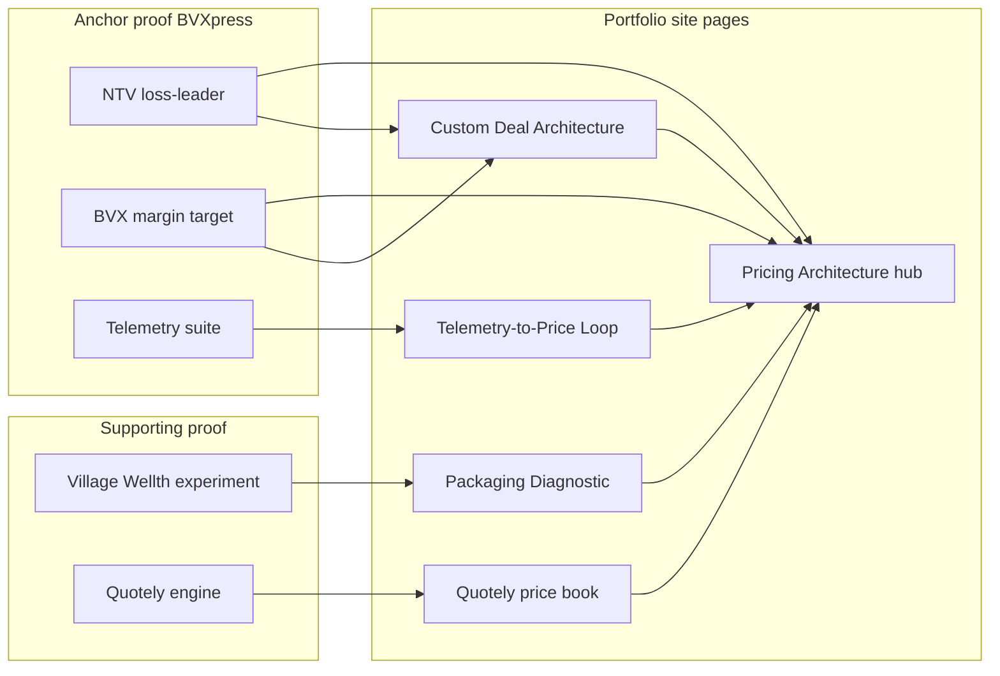

# Pricing Architecture — Study Guide and Portfolio Content System

This file is the **source of truth** for two linked goals:

1. **Mastery** — become genuinely expert in SaaS packaging and agentic/token monetization
2. **Portfolio site** — ship a durable public body of work under the brand **Pricing Architecture**

It replaces the typo-named draft `pricin.md`. Study phases produce **site-ready artifacts** (pages, frameworks, tools), not just notes.

**Related:** portfolio cases in [`PORTFOLIO/CONCEPT3/`](../PORTFOLIO/CONCEPT3/); evals companion [`evals_and_harness_study_roadmap.md`](evals_and_harness_study_roadmap.md). Career facts: [`RES/data/master_context.md`](../RES/data/master_context.md).

---

## Canonical reference: BVXpress product ladder

**Repo source of truth** for case studies, portfolio copy, and pricing frameworks.

| Entity | Definition |
|--------|------------|
| **Parent** | M&A advisory firm (**ICI** in portfolio copy) |
| **BVXpress** | The firm's **SaaS business unit** — deal-structuring and valuation software for advisors, brokers, and appraisers (2012–2021; employee #3 / first product hire) |
| **BVX** | **Upper-end** product — full valuation capability; the **economic target** of the commercial system |
| **NTV** | **New Terminal Value** — **low-end** product, **devised as a loss-leader** to open an adjacent market and pull users to BVX via deliberate feature-set differentiation |

### The NTV → BVX commercial strategy (not just a tier list)

NTV was not "cheap BVX." It was a **pricing and packaging decision**:

1. **Adjacent market entry** — BVX's full valuation workflow did not fit every buyer segment (price, complexity, or job-to-be-done). NTV was priced and scoped to **enter an adjacent segment** the core product could not land economically on its own.
2. **Loss-leader economics** — NTV could be sold at **thin or negative margin** in custom deals because its job was **acquisition into the BVXpress ecosystem**, not standalone profit maximization.
3. **Feature-set pull** — Upgrade to BVX was driven by **deliberate capability fences** (what NTV can vs cannot do), not sales pressure alone. Telemetry showed which fences triggered upgrade intent vs churn.
4. **Suite expansion** — NTV → BVX → presentation/export modules → broader 8-product suite. Multi-product adopters (3+) retained at **2×**.

```
Adjacent segment (won't buy BVX at entry)
        │
        ▼
   NTV (loss-leader land) ──feature ceiling──► friction / upgrade signal
        │
        ▼
   BVX (target SKU, full margin)
        │
        ▼
   Presentation + suite modules (ARPU expansion without list hike)
```

**Packaging logic in deals:**

```
NTV module (loss-leader price in custom deal)
+ BVX module (target ARPU / margin)
+ Feature fences visible in-product (not just on price sheet)
+ Seats, term, customer-specific discount
+ Expansion triggers instrumented in telemetry
```

- **No public price book** — customized unique pricing and discounts per customer; NTV discount depth varied by segment and upgrade potential
- **Telemetry** (in-house analytics suite + Pendo/Mixpanel-class tooling) drove: which accounts got NTV-only vs NTV+BVX bundles, which features to fence, enhance/deprecate, and **automated pricing evolution** from usage patterns
- **Measured outcomes:** ARPU $450→$600 (voluntary BVX/suite upgrades, not list hikes); 14% retention lift; 7% conversion lift from repositioning; 2× retention at 3+ products

When writing case studies: **NTV = strategic loss-leader**, **BVX = margin target**, **feature fences = upgrade engine**. Do not describe NTV as "Net Transaction Value."

---

## Part 0C: BVXpress — how pricing architecture was applied (deep dive)

This section maps **every framework in this doc** to what actually ran at BVXpress for 9 years. Use it as the backbone for `/work/bvxpress`, BVX/NTV case pages, and the signature long essay.

### 1. Market structure and the NTV loss-leader bet

**Core market (BVX):** M&A advisors and business brokers running sub-$50M deals on Excel — needed full valuation and deal-structuring workflow, client-ready output, professional presentation.

**Adjacent market (NTV entry):** Buyers whose job-to-be-done was **terminal-value / exit-value framing** without full BVX complexity or price. They would not have entered at BVX's capability or ACV — but could be **acquired economically** with NTV.

**Strategic intent:**

| Question | Answer at BVXpress |
|----------|-------------------|
| Why build NTV at all? | Open adjacent segment; lower CAC into ecosystem |
| Why price it as loss-leader? | Standalone NTV margin was not the goal — **NTV→BVX conversion and suite depth** were |
| Why not discount BVX instead? | Would erode anchor price and train discount expectation on the margin product |
| How do you pull to BVX? | **Feature-set differentiation** — NTV does terminal-value job; BVX unlocks full valuation, depth, and downstream workflow |

**Portfolio honesty:** Loss-leader only works if you instrument **conversion, expansion, and blended margin** — not NTV standalone P&L.

---

### 2. Feature-set differentiation (the upgrade engine)

Packaging was not only on the **price sheet** — it was **in the product**. NTV and BVX shared a family UX but differed on capability fences.

**Fence types to document on case pages** (fill with exact feature list from memory / old specs):

| Fence dimension | NTV (loss-leader) | BVX (target SKU) |
|-----------------|-------------------|------------------|
| Valuation scope | Terminal / exit-value workflow | Full business valuation & deal structure |
| Model depth | [Fill: simplified assumptions, fewer scenarios] | [Fill: full scenario / sensitivity tooling] |
| Output / presentation | [Fill: basic export] | [Fill: client-ready presentation suite — drove ARPU expansion] |
| Collaboration / seats | [Fill: limits] | [Fill: team / multi-user patterns] |
| Integrations / data | [Fill: if applicable] | [Fill: if applicable] |
| Support / onboarding | [Fill: if differentiated] | [Fill: if differentiated] |

**How telemetry used fences:**

- Track **fence hits** — users repeatedly attempting BVX-only actions inside NTV (upgrade signal)
- Track **workflow completion** — NTV users who complete terminal-value job but churn on presentation step (expand with presentation module, not deeper discount)
- Track **time-to-first-client-output** — repositioned GTM when &lt;20% WAU showed demos ≠ adoption (**7% conversion lift** from message change)

**Key insight:** Village Wellth fixed **decision architecture** (too many tiers). BVXpress fixed **capability architecture** (NTV vs BVX fences) **and** **deal architecture** (custom net price per account).

---

### 3. Custom deal architecture (every customer unique)

No public price book. Every account was a **composed deal**:

```
DEAL =
  Module mix (NTV only | NTV+BVX | BVX primary | + suite modules)
× Seat count / user bands
× Term (annual, multi-year)
× Customer-specific discount (negotiated — often deepest on NTV land)
× Expansion rights (upgrade to BVX, add presentation, add products)
```

**How discounts actually worked:**

- **NTV** carried the most aggressive discount — acceptable because it was the **loss-leader leg**
- **BVX** discount bands were tighter — protected margin on the target SKU
- **Bundle discount** preferred over single-module discount — incentivized NTV+BVX composition in year 1 when telemetry said they'd adopt both
- **Trade-based discounting** — term length, logo rights, case study, faster close — not "because AE asked"

**Telemetry informed deal design:**

- Segment profiles (customer type, deal size, product mix) tested via in-house analytics
- **Automated pricing evolution** from usage-pattern analysis — which module combinations predicted retention and ARPU growth
- CAC payback and MQL→SQL velocity tracked from scratch — pricing changes evaluated against pipeline, not just logo churn

---

### 4. Telemetry-to-Price Loop (operational detail)

| Stage | BVXpress application |
|-------|---------------------|
| **Instrument** | In-house analytics suite + Pendo; product events on module usage, deal-flow completion, export/presentation actions, fence-hit attempts |
| **Diagnose** | &lt;20% WAU despite demo praise; abandonment before first deal flow; fee-benchmarking high demo / zero workflow usage |
| **Hypothesize** | Value metric = client-ready output speed, not model depth; NTV lands adjacent segment; BVX fences drive upgrade |
| **Change** | Kill fee-benchmarking & deal-database bets; pivot products 3–5 to presentation/export; adjust NTV/BVX fences; evolve custom deal templates by segment |
| **Measure** | WAU, NTV→BVX upgrade rate, multi-product count, ARPU ($450→$600), retention (+14%), conversion (+7%), 3+ product adopters at 2× retention |

**Enhance vs deprecate gates** (examples):

- **Deprecate:** fee-benchmarking (demo feature, not workflow)
- **Enhance:** presentation/export (voluntary upgrade driver)
- **Repackage:** NTV loss-leader depth per segment when conversion to BVX lagged
- **Gate launches:** products 3–5 only after 20+ user cohort showed workflow adoption

---

### 5. Expansion revenue without list-price hikes

| Expansion lever | Mechanism | Proof |
|-----------------|-----------|-------|
| NTV → BVX upgrade | Feature fences + in-product upgrade path | Core loss-leader payoff |
| BVX → presentation tools | Workflow friction diagnosis (4+ hr formatting) | Voluntary ARPU $450→$600 |
| Single → multi-product | Land-and-expand in custom deals | 3+ products → 2× retention |
| Onboarding depth | Lifecycle messaging, guided first deal flow | 14% retention increase |
| Positioning | "Excel → client presentation" vs "most accurate" | 7% conversion lift |

**What did not drive ARPU:** annual list-price increases on existing modules. Growth was **module adoption and upgrade**, instrumented by telemetry.

---

### 6. Framework application map (study doc → BVXpress)

| Framework (this doc) | Applied at BVXpress how |
|----------------------|-------------------------|
| Value Metric Tree | Workflow output speed & client presentation, not seat count or model complexity |
| Packaging Diagnostic | WAU collapse → structural pivot (not tooltip fixes) |
| Good-Better-Best | NTV (land/loss-leader) → BVX (target) → suite modules (expand) |
| Loss-leader ladder | NTV opens adjacent market; BVX captures margin |
| Feature fencing | In-product NTV vs BVX capability gaps |
| Custom Deal Architecture | Unique net price every customer; NTV discount deepest |
| Price waterfall | List module logic → negotiated discount → net ACV by leg |
| Telemetry-to-Price Loop | 9-year perpetual system |
| Land-and-expand | Custom deal composition + module add over time |
| Unit economics | CAC payback tracking; blended deal margin, not NTV standalone |

---

### 7. What to publish (site priority)

1. **`/work/bvxpress`** — this section as narrative spine (loss-leader strategy + telemetry + custom deals)
2. **`/work/bvxpress/ntv`** — adjacent market entry, loss-leader economics, fence design, conversion metrics to BVX
3. **`/work/bvxpress/bvx`** — margin target SKU, feature depth, presentation expansion, ARPU story
4. **`/pricing/frameworks/loss-leader-ladder`** — generalize NTV→BVX pattern (new framework page)
5. **Feature fence table** — publish sanitized NTV vs BVX matrix (high credibility, hard to fake)

**Signature line for BVXpress essay:**

> We didn't discount BVX to grow. We built NTV as a loss-leader to enter an adjacent market, used feature fences to pull users to BVX, and used telemetry to evolve custom deals for nine years — without a public price book.

---

## Part 0A: Positioning thesis

### What you are not

Generic LinkedIn pricing advice:

- "Raise prices 10–20% every year"
- "Charge what you're worth"
- "Three tiers: Good, Better, Best"
- "Usage-based is the future" (with no model for agent loops or margin floors)

That fails a board question on NRR, a CFO on inference cost doubling, or a channel partner who stops recommending you because packaging is confusing.

### Your wedge: Pricing Architecture

**Pricing Architecture** = deliberate design of how value is measured, packaged, presented, metered, expanded, and defended — across product, GTM, and billing.

### Proof hierarchy (how to tell the story on the site)

Not all pricing proof is equal. Lead with what endured.

| Tier | Case | Duration | What it proves | How to frame publicly |
|------|------|----------|----------------|------------------------|
| **Anchor** | BVXpress — **NTV** (loss-leader) + **BVX** (margin target) | 9 years; commercial model in perpetuity | Adjacent-market entry; feature-set pull; telemetry-driven custom deals; NTV→BVX conversion; suite expansion | "Loss-leader to enter, fences to upgrade, telemetry to evolve — for nine years." |
| **Operational** | Quotely / Moovez | Ongoing | Real-time price engines; margin protection; eval-gated quote accuracy | "This is how I build pricing systems that operators trust." |
| **Experiment** | Village Wellth | Short execution window; company pivoted after | Decision architecture; 4→3 tiers; 3× take rate; advisor channel unlock | "A sharp packaging fix that worked — before the business changed direction." |

**Do not** lead the portfolio with Village Wellth as if it were a multi-year pricing program. It was a real, high-signal packaging intervention with measurable results — but BVXpress is where the **commercial system** lived.

| Layer | Definition | Anchor proof |
|-------|------------|--------------|
| **Telemetry-driven pricing** | Instrument usage → decide enhance/deprecate → evolve packaging and price | BVXpress: in-house analytics suite; &lt;20% WAU surfaced real friction; automated pricing evolution from usage patterns |
| **Custom deal architecture** | Per-customer list price + discount logic when every buyer is different | BVXpress: customized unique pricing for all customers; not a single public price book |
| **Decision architecture** | How buyers (and channels) choose among offers | Village Wellth: 4→3 tiers, 3× take rate — advisor gatekeeping was the bottleneck |
| **Operational price engines** | How a computed price is trusted in production | Quotely: OR vs 40%+ lookup error; price-band evals; speed-to-quote wins bookings |
| **Loss-leader ladder** | Deliberate low-margin SKU to enter adjacent market; margin captured on target SKU | NTV → BVX; blended deal economics, not NTV standalone P&L |
| **Feature-set fencing** | Upgrade driven by in-product capability gaps, not discounting the premium product | NTV vs BVX scope; presentation tools as expand fence |

**The gap to close publicly:** Publish the BVX/NTV commercial system (telemetry → custom pricing → expansion) as your signature case pair, then extend the playbook to SaaS metering and agentic/token economics.

### Signature POV (lock in Phase 0)

Repeat for 12 months:

> Pricing problems are architecture problems: wrong value metric, wrong fence, or wrong meter. At BVXpress we used NTV as a loss-leader into an adjacent market and feature-set differentiation to pull users to BVX — all instrumented by telemetry and custom deal design, not a public price book.

Refine until it is true, specific, and non-obvious. This sentence is the hero line on the Pricing hub page.

### Proof → publish bridge



---

## Part 0B: Portfolio website architecture

Build the site **around this file**, not around a dump of case HTML. Cases prove you; frameworks and teardowns make you a named voice.

### Site information architecture

Suggested routes (adapt to your stack; keep slugs stable):

| Route | Page type | Primary source in this doc |
|-------|-----------|----------------------------|
| `/pricing` | Hub — thesis, pillars, proof strip, CTA | Part 0A + Appendix B |
| `/pricing/frameworks/loss-leader-ladder` | Framework | Part 0C §1 + Deep-dive K |
| `/pricing/frameworks/telemetry-to-price-loop` | Framework | Deep-dive I |
| `/pricing/frameworks/custom-deal-architecture` | Framework | Deep-dive J |
| `/pricing/frameworks/packaging-diagnostic` | Framework | Deep-dive B |
| `/pricing/frameworks/value-metric-tree` | Framework | Deep-dive A |
| `/pricing/frameworks/hybrid-saas-ai-canvas` | Framework | Deep-dive D |
| `/pricing/frameworks/agent-cost-stack` | Framework | Deep-dive F |
| `/work/bvxpress/ntv` | Case — loss-leader | Part 0C + Appendix E.1 |
| `/work/bvxpress/bvx` | Case — margin target | Part 0C + Appendix E.2 |
| `/work/bvxpress` | Case — commercial engine overview | Part 0C + CONCEPT3 |
| `/work/village-wellth` | Case — packaging experiment | CONCEPT3 + Appendix E.3 |
| `/work/quotely` | Case + link to price book | CONCEPT3 + Project 1 |
| `/pricing/quotely-price-book` | Speculative price book | Project 1 |
| `/pricing/teardowns/[slug]` | Teardown series | Project 3 template |
| `/pricing/tools/credit-calculator` | Interactive or static tool | Project 4 |
| `/pricing/writing/[slug]` | Essays / memos | Part 5 calendar |

### Three brand pillars (every public page tags one)

1. **Pricing Architecture** — decision design + commercial systems
2. **SaaS packaging** — metrics, fences, expansion
3. **Agentic monetization** — credits, cost floors, controls

### Page content model (reuse everywhere)

Every public page should answer, in order:

1. **Diagnosis** — what is broken (one sentence)
2. **Framework** — named model (yours or attributed)
3. **Proof** — a number or case beat
4. **Fix** — what to do next (actionable)
5. **Next** — link to related framework or case

Voice: lead with diagnosis, not definition. No listicles without a model. One number + one named framework per piece.

### Hub page wireframe (`/pricing`)

```
[Hero]
  Brand: Pricing Architecture
  POV sentence (locked)
  CTA: View frameworks | View cases

[Proof strip]
  $450→$600 ARPU | 2× multi-product retention | 3× take rate (VW) | 20× quote speed

[Three pillars]
  Architecture | SaaS packaging | Agentic monetization
  → BVX/NTV anchor each pillar with telemetry + custom deal proof

[Framework library]
  Telemetry-to-Price Loop | Loss-Leader Ladder | Custom Deal Architecture
  Value Metric Tree | Hybrid Canvas | Agent Cost Stack

[Selected writing]
  Latest 3 teardowns / essays

[Cases — ordered by proof weight]
  NTV | BVX | BVXpress overview | Quotely | Village Wellth
```

### Ship order for the site (do this before LinkedIn volume)

| Priority | Ship | Why first |
|----------|------|-----------|
| P0 | `/pricing` hub + POV | Brand container |
| P0 | `/work/bvxpress` overview (Part 0C spine) | Loss-leader + telemetry narrative container |
| P0 | `/work/bvxpress/ntv` + `/work/bvxpress/bvx` | Anchor proof pair |
| P0 | Framework: Loss-Leader Ladder | Names the NTV strategy |
| P0 | Framework: Telemetry-to-Price Loop | Operational method |
| P1 | `/work/bvxpress` overview + Custom Deal Architecture framework | Ties BVX/NTV to custom discount reality |
| P1 | Packaging Diagnostic framework page | Repeatable; Village Wellth is the worked example |
| P2 | Quotely case + price book | Operational engine + speculative SaaS packaging |
| P2 | Hybrid SaaS+AI Canvas | Agentic differentiation |
| P3 | Village Wellth case (honest framing) | Sharp experiment, not anchor story |
| P3 | Teardown index + first 3 teardowns | Cadence engine |
| P4 | Credit calculator + agent margin memo | Tools + niche ownership |

**Rule:** Site pages before social volume. LinkedIn amplifies what already lives on your domain.

### Artifact → page checklist

| Artifact from study | Becomes | Done when |
|---------------------|---------|-----------|
| Signature POV | Hub hero | One sentence locked |
| BVX case study | `/work/bvxpress/bvx` | Telemetry + packaging + custom pricing arc complete |
| NTV case study | `/work/bvxpress/ntv` | Complements BVX; shows multi-product commercial logic |
| Telemetry-to-Price Loop | Framework page | 5-step loop with BVXpress worked example |
| Custom Deal Architecture | Framework page | Explains per-customer discount system without apologizing for it |
| Packaging Diagnostic (6 steps) | Framework page | Village Wellth as secondary worked example |
| Value Metric Tree | Framework page | BVX/NTV + Quotely worked examples |
| Hybrid Canvas | Framework page | Quotely + agent add-on filled example |
| Agent Cost Stack | Framework page | Formula + control table |
| Quotely price book | Spec page | Buyer understands in one scroll |
| Village Wellth rewrite | Case page | Honest duration + pivot context; decision architecture climax |
| Teardown template | Content type | 6 published |
| Credit calculator | Tool page | Margin scenario sliders work |

---

## Part 1: Knowledge map

Seven domains. Each: **must know** / **must do** / **portfolio bridge** / **site artifact**.

### Domain 1: Value and willingness-to-pay

**Must know:** EVC vs price; consumer surplus; 1st/2nd/3rd-degree price discrimination; value metric; Van Westendorp PSM; conjoint; MaxDiff; *Monetizing Innovation* — package before you build.

**Must do:** Defend a value metric against two alternatives; run a light Van Westendorp (n≈30); map "loved feature" → tier fence.

**Portfolio bridge:** BVX/NTV: telemetry showed advisors paid for **presentation speed**, not deeper analysis — value metric was workflow output; Village Wellth plan-selection churn = WTP as decision friction; Moovez buyers valued time-to-price.

**Site artifact:** Value Metric Tree with BVX, NTV, and Quotely worked examples.

---

### Domain 2: SaaS packaging architecture

**Must know:** GBB jobs (land / target / expand); fences (features, limits, support, SLA, integrations, compliance); land-and-expand; PLG traps (tourist freemium, unlimited abuse); packaging as strategy.

**Must do:** Draw a 3-tier entitlement matrix; diagnose "too many tiers" vs "wrong fences"; design tier-migration paths.

**Portfolio bridge:** BVX + NTV as multi-product suite with distinct jobs; Village Wellth noise tiers (short-lived experiment); Moovez V1 deferred subscriptions.

**Site artifact:** BVX + NTV case pages; Packaging Diagnostic with Village Wellth as worked example only.

---

### Domain 3: Price model taxonomy

| Model | Scales with | Works when | Fails when |
|-------|-------------|------------|------------|
| Per seat | Users | Value tracks headcount | Power users destroy AI margin |
| Flat platform | Account | Simple buy; high adoption | Heavy users; no expansion signal |
| Usage / metered | Consumption | Cost and value scale together | Bill shock; forecast pain |
| Credits | Abstracted usage | Predictability + your flexibility | Opaque units; true-up fights |
| Hybrid (seat + usage) | Team + consumption | AI/SaaS with variable inference | Sales can't explain in one slide |
| Outcome / success | Results | Attributable, contractable | Attribution; moral hazard |

**Must do:** Recommend a model and name the failure mode you avoid; know when to abstract tokens into credits.

**Portfolio bridge:** BVX/NTV sold with **custom per-customer pricing** — not a public SKU matrix; Quotely needs a distinct SaaS metric at spin-off.

**Site artifact:** Custom Deal Architecture framework + Quotely price book (contrasting "no public price book" vs "designed price book").

---

### Domain 4: Unit economics and expansion

**Must know:** ARPU, ACV, CAC, LTV, payback, gross margin; GRR vs NRR; expansion paths; price waterfall; discount governance.

**Must do:** Logo vs dollar retention; explain BVXpress ARPU as expansion without list hike; set discount floors.

**Portfolio bridge:** BVXpress ARPU $450→$600 as expansion without list hike; custom discounts per customer = price waterfall in practice; Village Wellth take rate as channel conversion; Moovez CAC/LTV.

**Site artifact:** Custom Deal Architecture + discount waterfall one-pager.

---

### Domain 5: Metering and billing systems

**Must know:** Entitlements vs meters; prepaid credits, minimums, overage, true-up; event → meter → bill → invoice; usage UX (dashboards, budgets, alerts). Vendors (Stripe Billing, Orb, Metronome, Chargebee) teach patterns — do not lock narrative to one.

**Must do:** Sketch `quote_generated` → meter → credit → 80% alert; design hard vs soft caps.

**Portfolio bridge:** BVXpress in-house telemetry suite — usage events drove enhance/deprecate and **automated pricing evolution**; Quotely price-band metrics = operational metering.

**Site artifact:** Telemetry-to-Price Loop framework + credit calculator.

---

### Domain 6: Agentic and token economics

**Must know:** Cost stack (inference → tools → retrieval → HITL → infra → margin); Jevons for agents (costs fall, usage rises); controllable vs agent-initiated usage; runaway loops; market hybrids (Cursor-style seat+credits; API per-token; outcome where attribution holds).

**Must do:** Cost → list price bridge; three controls (cap, human gate, degrade) tied to tiers; seat vs credit vs outcome for SMS agent.

**Portfolio bridge:** SMS agent HITL/deflection = cost and outcome drivers; Quotely vision→catalog→OR layers have different marginal costs.

**Site artifact:** Agent Cost Stack framework + agent margin memo.

---

### Domain 7: GTM and organizational pricing

**Must know:** PLG vs sales-led packaging; deal desk; channel packaging (advisors); price surfaces (landing, pricing page, in-app, collateral); owners (Product / Finance / Sales / RevOps).

**Must do:** One-scroll pricing page narrative; facilitate review in order: segment → metric → model → list → discount policy.

**Portfolio bridge:** BVXpress sales-assisted GTM with custom deals; Village Wellth advisor channel (brief execution); Moovez "out-quote, not out-price."

**Site artifact:** BVX/NTV cases + Quotely buyer one-pager + teardown series.

---

### Domain 8: Telemetry-driven pricing and custom deal architecture

**Must know:** Product telemetry as pricing input (not just growth metrics); in-house event pipelines; cohort and segment analysis for packaging decisions; when **every customer has a unique price** (enterprise / sales-led reality); discount as architecture, not leakage; enhance vs deprecate gates tied to usage data.

**Must do:** Map 5–10 telemetry events to packaging hypotheses; design a custom deal template (base + modules + discount bands); explain when to move from bespoke deals to standardized tiers.

**Portfolio bridge:** NTV devised as **loss-leader** for adjacent market; BVX as margin target; feature fences + custom deals + telemetry loop for 9 years.

**Site artifact:** Telemetry-to-Price Loop + Custom Deal Architecture frameworks; BVX + NTV case pages.

---

## Part 2: Concept deep-dives (site-ready frameworks)

Name each framework publicly. Use the same names on the site and on LinkedIn.

### A. Value Metric Tree

```
START: What do customers say they buy?
│
├─ "More people using it" → PER SEAT
│   └─ Unbounded AI cost per seat? → HYBRID (seat + credits)
│
├─ "More work / output" → USAGE or OUTCOME
│   ├─ Fair, cheap to meter? → USAGE (API calls, jobs, quotes)
│   └─ Attributable + contractable? → OUTCOME (deflections, SQLs)
│
├─ "Faster time to X" → PLATFORM FEE + tier by speed/SLA
│   └─ BVXpress: presentation speed, not seat count
│
└─ "We can't predict volume" → CREDITS
    └─ Define 1 credit = map to cost stack
```

**Worked — Quotely**

| Option | Metric | Pros | Cons |
|--------|--------|------|------|
| A | Per operator seat | Simple | Misses quote volume |
| B | Per quote | Aligns value/cost | Bill shock, seasonality |
| C | Per location | Matches buyer entity | Under-monetizes high volume |
| D | Platform + included quotes + overage | Predictable + expand | Richer pricing page |

**Site default recommendation:** D for mid-market; A as land for small shops.

**Worked — Village Wellth (packaging experiment):** Value was per deal/engagement buried in tier noise. Fix was legibility first. **Site framing:** real 3× take-rate result; company pivoted afterward — use for Packaging Diagnostic, not as decade-long pricing proof.

**Worked — NTV (New Terminal Value, loss-leader):** Devised to enter an **adjacent market** that would not buy BVX at entry price/capability. Sold at thin margin in custom deals; success measured by **NTV→BVX conversion** and blended deal economics, not NTV standalone P&L.

**Worked — BVX (upper end, margin target):** Full valuation SKU. Users pulled from NTV via **feature-set differentiation** (capability fences in-product). Presentation/export modules drove voluntary ARPU $450→$600.

---

### B. Packaging Diagnostic (Village Wellth → SaaS)

Reusable audit. **Primary publish example:** Village Wellth (with honest "executed, then pivot" context). **Anchor commercial example:** BVX/NTV telemetry-driven repackaging after WAU discovery.

| Step | Question | Village Wellth signal | BVXpress signal |
|------|----------|----------------------|-----------------|
| 1 | Where does churn concentrate? | Plan-selection | First deal flow / WAU collapse |
| 2 | Who else influences purchase? | M&A advisors | Sales + existing module adoption |
| 3 | Distinguish tiers in <30s? | Tree tests: no | Module matrix in custom deals |
| 4 | Multiple tiers, same segment? | STP: yes — noise | Demo-loved features with no usage |
| 5 | Cosmetic or structural? | Structural 4→3 | Kill fee-benchmarking; pivot to presentation |
| 6 | What behavior unlocks revenue? | Advisors stop pre-filtering | Multi-product adoption; voluntary upgrade |

**Public name:** Packaging Diagnostic. **Site:** interactive checklist or static 6-step page. **Most SaaS failures:** step 4 or step 2.

---

### C. Good-Better-Best with real fences

| Tier | Job | BVXpress mapping |
|------|-----|------------------|
| Land (loss-leader) | Enter adjacent segment; terminal-value job | **NTV** — priced for acquisition, not margin |
| Target (margin) | Full valuation; primary economic SKU | **BVX** — feature depth pulls upgrade from NTV |
| Expand | Client-ready output + suite depth | Presentation tools, HRIS, additional modules |

**Anti-pattern:** Discounting BVX to win deals NTV should land — erodes anchor and trains discount expectation on the margin product.

**BVXpress pattern:** NTV opens adjacent market → feature fences create upgrade pull → telemetry tunes fence placement and custom deal templates → suite modules expand ARPU without list hikes.

---

### D. Hybrid SaaS + AI Canvas

```
┌──────────────────────────────────────────────┐
│ PLATFORM FEE (monthly / annual)              │
│ seats + core features + base infra           │
├──────────────────────────────────────────────┤
│ INCLUDED CREDITS (per seat or account)       │
│ 1 credit = [quote | agent turn | …]          │
├──────────────────────────────────────────────┤
│ OVERAGE RATE (list + volume bands)           │
├──────────────────────────────────────────────┤
│ ENTERPRISE FENCE                             │
│ pooled credits, caps, HITL SLA, true-up      │
└──────────────────────────────────────────────┘

Blended GM = (Revenue − inference − HITL − infra) / Revenue
Know floor $/credit before list price.
```

---

### E. Price waterfall and discount governance

```
List
  − Promo (marketing)
  − Sales band (AE)
  − Strategic (VP)
  − Multi-year / prepay (finance)
= Net ACV
  − Credits / rebates
= Net cash
```

Rules: no discount without a **trade**; CFO floor; fences ≠ discounts.

---

### F. Agent Cost Stack

```
Per successful agent task:
  Model tokens
+ Tool calls (often 3–10× model)
+ Retrieval
+ HITL minutes × loaded rate
+ Orchestration %
= Fully loaded cost

List = Cost / (1 − target GM)
Credits = abstract N tasks at blended cost
```

| Control | Product | Pricing |
|---------|---------|---------|
| Hard cap | Stop at N credits | Trial / Free limit |
| Soft cap + degrade | Cheaper model / shorter context | Pro vs Enterprise quality |
| Human gate | Escalation queue | Enterprise or per-resolution overage |
| Loop detector | Max tool calls / session | Margin protection; ToS |

---

### G. Credit abstraction rules

**Credits when:** tokens confuse buyers; multi-model cost mix; you need to change models without repricing.

**Raw usage when:** developer audience; transparency is the product; FinOps buyers.

**Golden rule:** Buyer predicts typical monthly bill within ±20% without a spreadsheet.

---

### H. Packaging × GTM fit

| GTM | Packaging bias | Example |
|-----|----------------|---------|
| PLG | Few tiers, public price, hard limits | Notion, Figma |
| Sales-assisted | GBB + Contact sales for enterprise | Datadog, Snowflake |
| Channel / advisor | Story advisors can repeat in 30s | Village Wellth (brief) |
| Sales-led custom deal | Module matrix + negotiated net price | BVXpress BVX + NTV |
| Usage-native | Meters as core UX | AWS, OpenAI API |

**Edge:** telemetry-driven custom deal architecture at BVXpress for 9 years — rare among commentators who only know public pricing pages.

---

### I. Telemetry-to-Price Loop (BVXpress method)

The commercial system that **stuck for 9 years**. Not a one-off tier redesign.

```
1. INSTRUMENT — in-house telemetry + Pendo/Mixpanel-class events
      ↓
2. DIAGNOSE — cohort WAU, funnel drop-offs, feature usage vs demo praise
      ↓
3. HYPOTHESIZE — which packaging fence or product job is wrong
      ↓
4. CHANGE — enhance / deprecate / reprice / re-bundle (BVX, NTV, products 3–5)
      ↓
5. MEASURE — ARPU, retention, multi-product adoption, conversion lift
      ↓
   (loop forever)
```

**BVXpress signals that fed the loop:**

| Telemetry signal | Pricing/packaging decision |
|------------------|--------------------------|
| &lt;20% weekly active users despite strong demos | Pivot from analytical depth → presentation/export speed |
| Abandonment before first deal flow complete | Onboarding + packaging around workflow completion |
| Fee-benchmarking high demo interest, low usage | Kill product — demo feature, not workflow feature |
| Multi-product adopters (3+) retain at 2× | Land-and-expand; NTV+BVX bundle templates |
| NTV fence-hit / BVX-feature attempt events | Adjust fences; sales playbooks for upgrade |
| Usage-pattern analysis over time | Automated pricing evolution; NTV discount depth by segment; ARPU $450→$600 |

**Public name:** Telemetry-to-Price Loop. **Site:** framework page with diagram + BVX/NTV timeline.

---

### J. Custom Deal Architecture (when every customer is unique)

BVXpress did **not** run a single public price book. Every customer received **customized unique pricing and discounts**. That is not a failure of pricing maturity — it is a **deal architecture** choice common in sales-led B2B SaaS.

```
CUSTOMER DEAL =
  NTV module (loss-leader leg — deepest discount acceptable)
+ BVX module (margin leg — tighter discount bands)
+ Feature fences enforced in-product (not only on order form)
+ Suite modules (presentation, HRIS, etc.)
+ Seats, term, expansion triggers
```

**NTV-specific deal rules:**

- Discount NTV aggressively **only when** upgrade path to BVX is instrumented (telemetry on fence hits, conversion cohorts)
- Never match BVX capability at NTV price — fix with **fence**, not discount
- Prefer **NTV+BVX bundle** in year 1 when segment data shows both modules adopted

**Governance rules (what you actually did / should publish):**

- Telemetry informs **list logic** and **module fences** even when **net price is bespoke**
- Discounts tied to trades: term length, case study, bundle depth, strategic logo
- Track **net ACV** per customer — custom deals without measurement = margin mystery
- Know which modules drive retention (presentation tools → voluntary upgrade → ARPU)

**Contrast for portfolio:**

| BVXpress (historical) | Quotely (speculative SaaS) |
|-----------------------|----------------------------|
| Sales-led; custom deal per customer | Self-serve + sales-assisted tiers |
| Telemetry drives packaging; price negotiated | Public price book + overage |
| 9-year perpetual system | Greenfield packaging exercise |

**Public name:** Custom Deal Architecture. **Site:** framework page — positions you for enterprise pricing roles, not only PLG teardown artists.

---

### K. Loss-Leader Ladder (BVXpress pattern)

Use when the **margin product** cannot economically land an adjacent segment — but you can acquire them with a deliberate low-margin SKU and pull them up via **feature fences**.

```
ADJACENT SEGMENT (won't buy target SKU at entry)
        │
        ▼
LOSS-LEADER SKU (NTV) ── priced for acquisition; measure conversion not standalone GM
        │
        │  feature fences (in-product capability gaps)
        ▼
TARGET SKU (BVX) ── margin anchor; protect discount bands
        │
        ▼
EXPAND MODULES (presentation, suite) ── ARPU without list hike
```

**Design checklist:**

| Step | Question |
|------|----------|
| 1 | What adjacent segment will never enter at target SKU price/capability? |
| 2 | What is the minimum job the loss-leader must complete credibly? (NTV = terminal value) |
| 3 | Which capabilities are **only** on the target SKU? (must be real, not artificial crippling) |
| 4 | What telemetry proves fence hits → upgrade vs churn? |
| 5 | What blended deal margin makes the loss-leader rational? |
| 6 | When do you **stop** discounting the loss-leader? (conversion lagging, wrong segment) |

**BVXpress worked example:** NTV entered terminal-value buyers; BVX captured full valuation margin; presentation tools expanded ARPU. Custom deals let NTV carry the deepest discount without training BVX discount expectations.

**Public name:** Loss-Leader Ladder. **Site:** `/pricing/frameworks/loss-leader-ladder`

---

## Part 3: Practice projects → portfolio pages

### Project 0: BVX + NTV case studies (Phase 0–1 — anchor pages)

**Deliverables:** Overview page (Part 0C) + NTV + BVX case pages.

**Overview (`/work/bvxpress`):** Publish **Part 0C** as the narrative — loss-leader strategy, feature fences, custom deals, telemetry loop, 9-year outcomes.

**NTV page (`/work/bvxpress/ntv`) — suggested arc:**

1. **Strategic intent:** loss-leader to expand BVX into adjacent market (terminal-value buyers who wouldn't enter at BVX ACV)
2. **Economics:** thin/negative margin acceptable; measure NTV→BVX conversion and blended deal margin
3. **Job-to-be-done:** New Terminal Value workflow — credible standalone, intentionally scoped
4. **Feature fences:** what NTV deliberately does not do (points to BVX)
5. **Custom pricing:** deepest discounts on NTV leg; segment-specific deal templates from telemetry
6. **Telemetry:** fence-hit events, conversion cohorts, which adjacent segments justified loss-leader depth
7. **Outcome:** accounts that entered on NTV and expanded to BVX + suite (tie to 2× retention at 3+ products)

**BVX page (`/work/bvxpress/bvx`) — suggested arc:**

1. **Role:** margin target SKU — full valuation and deal structure
2. **Upgrade engine:** how feature-set differentiation pulls NTV users (not BVX discounting)
3. **Suite telemetry:** &lt;20% WAU discovery → presentation/output as real value metric
4. **Expansion:** presentation/export modules; ARPU $450→$600 voluntary upgrades
5. **Custom deals:** tighter discount bands on BVX leg; bundle preference over single-module discount
6. **Outcomes:** 14% retention, 7% conversion lift, 9-year perpetual commercial system

**Publish angle:** "NTV was the loss-leader. BVX was the business. Telemetry told us where to fence."

**Site task:** Fill the feature fence table in Part 0C §2 with exact NTV vs BVX capabilities from memory.

---

### Project 1: Quotely price book → `/pricing/quotely-price-book`

**Deliverable:** 2-page price book + entitlement matrix (also a site page).

**Inputs:** $500k+ GMV; ~3 min quotes; OR + evals protect margin; buyer = operator / ops / franchise HQ.

**Design:**

1. Land — 1–3 seats, N quotes/mo, core CV+OR
2. Growth — more quotes, multi-location, SMS agent add-on
3. Enterprise — pooled quotes, SLA, custom catalog, HITL

**Fences:** quotes/mo, locations, agent tier, catalog, API.

**Expansion:** seat → quote volume → agent → enterprise pool.

**Publish angle:** "How I'd price Quotely" — proves you monetize what you build.

---

### Project 2: SMS / agent monetization → `/pricing/writing/agent-monetization`

Compare seat vs per-resolution vs platform+credits. Price the escalation path using HITL / deflection from [`sms-agent-evals.html`](../PORTFOLIO/CONCEPT3/sms-agent-evals.html).

---

### Project 3: Teardown series → `/pricing/teardowns/[slug]`

Six public teardowns using Packaging Diagnostic + Value Metric Tree.

Suggested targets: Cursor; OpenAI API; Intercom/Zendesk AI; Snowflake; HubSpot; one vertical (logistics or HR).

**Template (800–1200 words / one web page):**

1. Who is the buyer?
2. What is the value metric?
3. Do tiers have distinct jobs?
4. What is fenced?
5. What breaks at scale?
6. One architecture fix

---

### Project 4: Credit calculator → `/pricing/tools/credit-calculator`

Inputs: tokens/task, tool calls, HITL rate, target margin %. Outputs: $/credit, tier list, break-even. Scenarios: model cost −50%, usage +100%.

---

### Project 5: WTP mini-study → short results page or appendix

Van Westendorp or MaxDiff; n=15–30 operators (or proxy). Output: acceptable range, optimal band, fence recommendation.

---

### Project 6: Village Wellth honest rewrite → `/work/village-wellth`

**Deliverable:** Case page with integrity framing.

**Must include:**

- What you did: 4→3 tiers, STP, advisor research, 3× take rate
- How long it ran before pivot (state accurately)
- What it proves: Packaging Diagnostic / decision architecture
- What it does not prove: multi-year commercial system (that's BVXpress)
- Link to Packaging Diagnostic framework

---

### Exercise index

| # | Exercise | Phase | Hours | Site output |
|---|----------|-------|-------|-------------|
| 0 | Draft BVX + NTV case outlines (Part 0C) | 0 | 4 | Overview + two case pages |
| 1 | Packaging Diagnostic on a public SaaS page | 1 | 2 | First teardown draft |
| 2 | Value metric tree ×3 (BVX, NTV, Quotely) | 1 | 2 | Framework worked examples |
| 3 | Loss-Leader Ladder framework page | 1 | 2 | `/pricing/frameworks/loss-leader-ladder` |
| 4 | Fill NTV vs BVX feature fence table (Part 0C §2) | 1 | 2 | Case page credibility |
| 5 | Telemetry-to-Price Loop filled for BVXpress | 1 | 2 | Framework page |
| 6 | Quotely price book | 2 | 4 | Price book page |
| 7 | Hybrid canvas Quotely + agent | 2 | 2 | Canvas filled example |
| 8 | Custom Deal Architecture doc | 2 | 2 | Framework page |
| 9 | SMS agent monetization memo | 3 | 3 | Writing page |
| 10 | Token/credit calculator | 3 | 3 | Tool page |
| 11 | Discount policy one-pager | 4 | 2 | Gated asset |
| 12 | WTP mini-study | 4 | 4 | Results appendix |
| 13 | Village Wellth honest rewrite | 1 | 2 | Case page |

---

## Part 4: Reading stack (sequenced)

Finish Phase 1–2 before deep agentic reading. Budget: 2 hrs read / 2 hrs write after Phase 2.

### Tier 1 — Foundations

| Source | Focus |
|--------|-------|
| Ramanujam, *Monetizing Innovation* | Ch 1–4, 7–9 |
| OpenView PLG monetization essays | Pricing for PLG, expansion |
| ProfitWell / Paddle research | Benchmarks, discount culture |
| Nagle, *Strategy and Tactics of Pricing* | Ch 1–3, 11 |

### Tier 2 — Packaging and usage

| Source | Focus |
|--------|-------|
| Kyle Poyar / OpenView | Packaging cases |
| Stripe usage billing docs | Events, meters, credits |
| Orb / Metronome blogs | Credits vs usage |
| Bessemer State of the Cloud | NRR by stage |

### Tier 3 — Agentic

| Source | Focus |
|--------|-------|
| OpenAI, Anthropic, Cursor pricing pages | Live hybrids |
| a16z / Greylock AI pricing essays | Margin framing |
| Your Quotely + SMS agent eval pages | Cost drivers you own |

### Tier 4 — Craft

| Source | Focus |
|--------|-------|
| BVX + NTV case drafts (Appendix E) | Anchor site copy |
| Village Wellth case copy | Packaging Diagnostic example only |
| Simon-Kucher / McKinsey pricing pieces | Vocabulary, not gospel |
| 3 practitioners you admire | Hook, framework name, evidence density |

---

## Part 5: Publishing OS (site + LinkedIn)

### Cadence rule

1. Draft for the **site** first (canonical URL)
2. Compress for LinkedIn (hook + framework name + link)
3. Never publish a framework only on LinkedIn

### 90-day calendar (aligned to site ship order)

| Week | Site page | LinkedIn | Pillar |
|------|-----------|----------|--------|
| 1 | Hub `/pricing` live | POV + loss-leader thesis | Architecture |
| 2 | `/work/bvxpress` overview (Part 0C) | "NTV was the loss-leader" | Architecture |
| 3 | NTV + BVX case pages | Feature fences + custom deals | SaaS |
| 4 | Framework: Loss-Leader Ladder | Framework launch | Architecture |
| 5 | Framework: Telemetry-to-Price Loop | Operational method | Architecture |
| 6 | Framework: Custom Deal Architecture | "No public price book for 9 years" | SaaS |
| 7 | Teardown: Cursor | Short teardown | Agentic |
| 7 | Framework: Packaging Diagnostic | Village Wellth as worked example | Architecture |
| 8 | Village Wellth case (honest framing) | Decision architecture story | Architecture |
| 9 | Quotely price book | How I'd price Quotely | SaaS |
| 10 | Framework: Hybrid Canvas | Agentic packaging | Agentic |
| 11 | Teardown: OpenAI API + vertical SaaS | Short teardowns | Agentic/SaaS |
| 12 | Long essay: Pricing Architecture for SaaS and Agents | Essay + CTA to hub | All three |

Batch drafts in weeks 4 and 8. Minimum one public asset per week.

### Distribution

- **Canonical:** portfolio domain (`/pricing`…)
- **Amplify:** LinkedIn (PM, founder, RevOps)
- **Later (after week 8):** guest post, podcast, Substack mirror — always link home

### Credibility loop


---

## Part 6: Mastery checkpoints

Pass without notes. Portfolio hub should already be live.

1. **Value metric defense** — BVX, NTV, Quotely; &lt;10 min each; metric, rejected alternative, failure mode avoided.
2. **Telemetry-to-Price Loop** — walk through BVXpress with 3 real telemetry signals and the packaging decision each triggered.
3. **Custom deal architecture** — design a module matrix + discount policy for a fictional 8-product suite; explain when net price is bespoke but fences are not.
4. **Hybrid package** — 3 tiers, credits, overage, enterprise fence, discount floor.
5. **Agentic margin crisis** — model −40%, usage ×2, GM flat → two pricing fixes + one product control.
6. **Packaging Diagnostic live** — any pricing page in 15 minutes; cite Village Wellth OR BVX telemetry as parallel.
7. **Case integrity** — explain in 60 seconds why Village Wellth is experiment proof and BVX/NTV is anchor proof without underselling either.
8. **Quality bar on last 3 posts** — named framework; one number; audience clear; actionable fix; pillar tagged.

---

## Appendix A: Glossary

| Term | Definition |
|------|------------|
| Value metric | Unit that scales price with value |
| Fence | Deliberate limit separating tiers or segments |
| Take rate | % of eligible transactions that convert to paid |
| NRR | Expansion − churn − contraction |
| Credit | Abstracted consumption unit |
| Price waterfall | List → discounts → net |
| EVC | Economic value to customer (price ceiling) |
| HITL | Human-in-the-loop (cost and quality lever in agent pricing) |
| NTV | New Terminal Value — loss-leader SKU to enter adjacent market; pulls users to BVX via feature fences |
| BVX | Upper-end / margin-target SKU — full valuation capability |
| Loss-Leader Ladder | Low-margin land SKU → feature-fenced upgrade → margin SKU → expand modules |
| BVXpress | SaaS business unit of the M&A advisory parent (ICI) |
| Telemetry-to-Price Loop | Instrument → diagnose → change packaging → measure (BVXpress) |
| Custom Deal Architecture | Per-customer module + discount composition when no public price book |

---

## Appendix B: Portfolio proof map

| Goal | Anchor proof (BVX/NTV) | Supporting proof | This system adds |
|------|------------------------|------------------|------------------|
| Long-run pricing architecture | 9yr telemetry loop; custom deals; ARPU expansion | Village Wellth 3× (short window) | Published frameworks + site |
| SaaS tier / module design | 8-product suite; multi-product 2× retention | VW tier consolidation | GBB + public price book (Quotely) |
| Pricing engines | Usage-pattern pricing evolution | Quotely OR + evals | Sell Quotely as SaaS |
| Discount / deal desk | Unique price per customer | — | Custom Deal Architecture page |
| Agent economics | — | SMS agent evals | Credits, caps, outcome pricing |
| Unit economics | CAC payback tracking; ARPU path | Moovez CAC/LTV | Waterfall templates |
| Public authority | CONCEPT3 BVXpress case (thin) | VW, Quotely HTML | BVX + NTV dedicated pages |

---

## Appendix C: 16-week timeline

| Weeks | Focus | Output |
|-------|-------|--------|
| 1–2 | Phase 0 + hub + BVX/NTV drafts | POV locked; `/pricing` live; anchor case outlines |
| 3–5 | Telemetry + custom deal frameworks | BVX + NTV pages live; Exercises 0–3 |
| 6–8 | SaaS models + Quotely | Price book; Hybrid canvas; Custom Deal Architecture |
| 9–10 | Agentic + Village Wellth | Calculator; honest VW case; teardowns |
| 11–16 | Publish + mastery | Calendar complete; checkpoints passed |

Do not skip exercises for more reading.

---

## Appendix E: Case study library (site copy seeds)

Use these as first drafts for portfolio pages. Expand with screenshots, anonymized deal structures, and telemetry examples where safe.

### E.1 NTV — New Terminal Value (loss-leader / adjacent market)

**Headline:** NTV wasn't the cheap tier — it was the loss-leader that opened an adjacent market BVX couldn't land on its own.

**Context:** **BVXpress** is the SaaS business unit of an M&A advisory firm. **NTV (New Terminal Value)** was **devised** as the **low-end, loss-leader product**: scoped for terminal-value / exit-value workflow in a buyer segment that would not enter at BVX price or capability.

**Strategic intent:**

- **Adjacent market entry** — acquire users economically where full BVX was the wrong fit at first touch
- **Loss-leader economics** — NTV margin sacrificed for ecosystem entry; success = **NTV→BVX conversion** + blended deal margin
- **Not a discounted BVX** — capability scoped in-product; deepest custom discounts applied to NTV leg, not BVX

**Feature-set role:** NTV completes a credible terminal-value job but **fences** full valuation, depth, and downstream workflow behind BVX. Telemetry tracked fence hits and upgrade paths.

**Commercial architecture:**

- Every customer: **unique pricing and discount** — NTV leg often most aggressively discounted
- Telemetry tuned which segments got NTV-only vs NTV+BVX bundles
- **Automated pricing evolution** from usage-pattern analysis across cohorts

**Key insight for site:** A loss-leader is a packaging strategy, not a price cut on your premium product.

---

### E.2 BVX — upper end / margin target

**Headline:** BVX was the business — NTV brought them in; feature fences and presentation modules pulled revenue up.

**Context:** **BVX** is the **upper-end** product: full business valuation and deal-structuring for advisors and brokers. The **economic target** of the NTV loss-leader ladder.

**The upgrade engine:**

- Users arriving via NTV upgraded to BVX when **feature-set differentiation** made the capability gap real (not when sales discounted BVX)
- Suite telemetry: &lt;20% WAU despite strong demos → value metric was **client-ready output**, not model depth alone
- Presentation/export modules became expansion fences → **ARPU $450→$600** without list-price hikes

**Commercial architecture:**

- **Tighter discount bands** on BVX than NTV in custom deals
- Bundle preference (NTV+BVX) when segment data supported joint adoption
- Multi-product depth (3+ products) → **2× retention**

**Key insight for site:** Protect the margin SKU's price integrity; pull upgrades with fences, not discounts.

---

### E.3 Village Wellth — packaging experiment (honest framing)

**Headline:** 3× take rate from tier consolidation — before the company changed direction.

**Context:** Fractional pricing/packaging engagement on a B2C M&A financing platform. Opaque, advisor-mediated plan selection was killing conversion.

**What you did:** STP analysis, focus groups with advisors, tree tests, structural consolidation 4→3 tiers, migration strategy. **Take rate improved 3×** in two billing cycles; plan-indecision churn near zero. Primary unlock: **advisors stopped pre-filtering clients**.

**Duration and status:** Executed and measured successfully; **the company pivoted** afterward. This is high-quality **decision architecture** proof — not evidence of a multi-year commercial pricing program.

**How to use on site:**

- Lead with the Packaging Diagnostic framework
- Cite metrics with integrity
- Contrast with BVXpress: "one sharp packaging fix" vs "9-year telemetry-driven commercial system"

**Key insight:** Pricing problems are often decision architecture problems — but a winning packaging fix does not guarantee business permanence.

---

## Appendix D: Changelog

| Date | Change |
|------|--------|
| 2026-07-22 | Initial study + portfolio system (`pricin.md` → `pricing.md`) |
| 2026-07-22 | NTV reframed as loss-leader for adjacent market; Part 0C deep dive; Loss-Leader Ladder framework (K) |

---

*Last updated: 2026-07-22. Companion: [`evals_and_harness_study_roadmap.md`](evals_and_harness_study_roadmap.md). Portfolio: [`PORTFOLIO/CONCEPT3/`](../PORTFOLIO/CONCEPT3/).*
