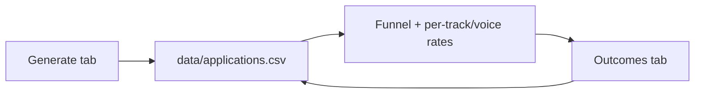

# RES: Analysis and Implementation Plan

Single-user local Streamlit resume generator. This doc records what to fix, what to skip, how to ship it, and required UI work in `app.py`.

---

## Feasibility triage

| Decision | Items |
|----------|--------|
| **Cut** | PostgreSQL/TimescaleDB, email tracking pixels, ATS/CRM webhooks, RL/bandits, LoRA fine-tuning, Grafana/Prometheus/Celery, Welch/Bayesian significance testing, automated cross-company application submit |
| **Already built** | Per-role full/condensed (`role_selections`, `is_condensed`); PM MOVE labels sentence-case + bolded in `parse_bullet_line` |
| **Demote** | "ATS Match %" printed on the resume (self-graded; keep coverage in-app only via existing ATS card) |
| **Ship** | Phase A formatting, Phase C outcome tracker, Phase D export guardrails (2-page PDF), Phase B opt-in positioning |

**Why cut the heavy stack:** tens of applications and rare offers cannot support RL, fine-tuning, or significance tests; infra cost dominates any insight.

**Suggested build order:** Phase A → Phase C → Phase D (2-page PDF + export guardrails) → Phase B (optional positioning toggles, measurable via C).

---

## Findings (what still needs work)

### Strengths (keep)

- Anti-fluff prompts and truth filter (`COACHING NOTE` vs fabrication)
- Narrative Brief → JD Pain → Profile Angle thread across sections
- ATS keyword coverage in-app (`check_keyword_coverage`, target ≥80%)
- Section hierarchy and per-role density control
- Low cost per run (`data/history.md`)

### Open issues (address in Phases A–B)

| Issue | Fix |
|-------|-----|
| Bullets read as walls of text | More `li` / DOCX `space_after` spacing (A1) |
| Metrics hard to scan | Bold first metric per bullet (A2) |
| Company hook blends with summary | Bold first 3–5 words of company-desc (A3) |
| No at-a-glance outcomes | Key Results row under Quick Take (B1) |
| Quick Take must stay metric-free | **Zero metrics** in Quick Take; numbers only in How I Work / The Work / optional Key Results (B1) |
| No progression narrative | Optional progression line atop The Work (B3) |
| No funnel learning | Manual `applications.csv` + Outcomes tab (C) |
| PDF can exceed 2 pages | Phase D: page count, download gate, compact workflow |

**Deferred (low ROI now):** contact line layout, muted PM MOVE label color, section header styling, anonymized company names (intentional), Side Builds JD tie-in (prompt-only, later).

---

## Phase A — Scan/formatting (no LLM, no UI)

Pure PDF/DOCX rendering. Defaults unchanged.

| ID | Work | Files |
|----|------|-------|
| A1 | Bullet whitespace: `li` margin 4px → 6–7px; slight bump on `.role-summary` / `.company-desc`; DOCX `space_after = Pt(4–6)` on bullets | `assets/template.html`, `doc_generator.py` |
| A2 | Bold first metric in bullet: shared regex in `generator.py` (`\d+%`, `\d+x`, `$\d+[kKmM]?`, `\d+\s*(min\|hours\|days)`); apply in `pdf_generator.parse_bullet_line` and DOCX bullet runs | `generator.py`, `pdf_generator.py`, `doc_generator.py` |
| A3 | Bold first 3–5 words of `company-desc` line | `pdf_generator.py`, `doc_generator.py` |

**Done when:** 3-role sample shows clearer spacing, ≥1 bold metric per quantified bullet, PDF still ≤2 pages.

---

## Phase B — Positioning (sidebar toggles + templates)

All toggles **default off** so current output is unchanged unless enabled.

| ID | Work | Files |
|----|------|-------|
| B1 | Curated `## Resume headline metrics` in `master_context.md` (e.g. `3× take rate · 85% false-alert reduction · $500k+ GMV`). Render under Quick Take when toggle on. | `data/master_context.md`, `template.html`, `doc_generator.py`, `app.py` |
| B3 | Curated progression line in `master_context.md`; render atop "The Work" when toggle on. | `master_context.md`, `template.html`, `doc_generator.py`, `app.py` |

**Quick Take rule (not optional):** no metrics, no tool laundry list, no em/en dashes. Metrics belong in How I Work, The Work, and optional Key Results only.

**Done when:** toggles on → row/line appear with only master-context facts; toggles off → same output as today.

---

## Phase C — Local outcome tracker

No servers, no pixels, descriptive stats only.



| ID | Work | Files |
|----|------|-------|
| C1 | On each successful generation, append CSV row: `app_id, date, company, role, track, voice, ats_coverage, stage`. `app_id` = short hash; `stage` default `sent`. Hook next to `append_to_history`. Keep `history.md` as-is. | `app.py`, new `data/applications.csv` |
| C2 | Stage enum: `sent → replied → screen → interview → final → offer → accepted`; terminal `rejected`, `ghosted`. Helper: weighted score from analysis weights, re-normalized without `opened`. | `app.py` (or small `outcomes.py`) |
| C3 | Outcomes tab: list rows, stage `selectbox` per row, persist to CSV. | `app.py` |
| C4 | Funnel counts, reply rate, screen rate; breakdown by `track` and `voice`. Caption: small-n, descriptive only. | `app.py` |

**Done when:** every generation adds one row; changing stage updates funnel and per-track reply rate.

---

## UI changes (`app.py`)

Phase A needs no Streamlit changes. Phases B and C require the following.

### 1. Top-level navigation

**Current:** three tabs — Job Details, Application Questions, Generate & Output.

**Change:** add a fourth tab:

```text
tab_job, tab_questions, tab_generate, tab_outcomes = st.tabs([
  "📋 Job Details",
  "❓ Application Questions",
  "🚀 Generate & Output",
  "📊 Outcomes",
])
```

### 2. Sidebar — "Resume presentation" (Phase B)

Insert after **PDF layout** and before **Cost Controls** (`app.py` ~line 678):

| Control | `key` | Default | Effect |
|---------|-------|---------|--------|
| `st.sidebar.subheader("Resume presentation")` | — | — | Groups B toggles |
| `st.sidebar.checkbox("Show Key Results row", ...)` | `show_key_results` | `False` | B1: pass `key_results` into PDF/DOCX context |
| `st.sidebar.checkbox("Show career progression line", ...)` | `show_career_progression` | `False` | B3: pass `career_progression` into renderers |
| `st.sidebar.checkbox("Compact PDF typography", ...)` | `compact_pdf` | `False` | Phase D3: tighter CSS when over 2 pages |
| `st.sidebar.caption(...)` | — | — | "Sourced from master_context.md only; no new numbers from the model." |

Load headline metrics and progression from `master_context.md` at startup (parse `## Resume headline metrics` and a dedicated progression heading/line). If section missing and toggle on, show a one-line `st.sidebar.warning` on Generate tab.

Wire toggles into:

- LLM call for mission (`generate_mission_statement(..., allow_one_metric=...)`)
- `resume_sections` / template context for PDF and DOCX builders

### 3. Generate tab — post-generation (Phase C1)

After `append_to_history` (~line 1060), call `append_application_record(...)` with:

- `company`, `role`, `track`, `voice` from session state
- `ats_coverage` = `kw_coverage` (float 0–1, same as ATS card)
- `date` = today ISO

**UI feedback** (below existing success banner):

```python
st.caption(f"Logged application `{app_id}` → data/applications.csv (stage: sent)")
```

Optional: `st.session_state.last_app_id = app_id` for quick lookup on Outcomes tab.

Do **not** add ATS % to downloaded PDF/DOCX.

### 4. Outcomes tab — layout (Phase C3–C4)

**Empty state:** if CSV missing or zero rows → `st.info("No applications logged yet. Generate a resume to create the first row.")`

**With data:**

1. **Summary row** (`st.columns(4)` or metrics): total apps, reply rate (`replied / sent`), screen rate (`screen / sent`), offers (`offer + accepted` count).
2. **Funnel** — `st.bar_chart` or compact HTML/table: counts per stage (`sent`, `replied`, `screen`, `interview`, `final`, `offer`, `accepted`, `rejected`, `ghosted`).
3. **By track / by voice** — two small dataframes or bar charts with raw counts + rates (not ranked "winners" without n).
4. **Application table** — `st.data_editor` or repeated blocks:
   - Columns: Date, Company, Role, Track, Voice, ATS %, Stage (selectbox), App ID
   - Stage change writes CSV immediately (`on_change` or **Save** button per row to avoid partial writes)
5. **Footer caption:** `Descriptive stats only — small sample; not A/B significance.`

**Helpers** (can live in `app.py` or `outcomes.py`):

- `load_applications() -> pd.DataFrame`
- `save_applications(df)`
- `compute_funnel(df) -> dict`
- `compute_rates(df, group_col=None) -> DataFrame`

### 5. Generate tab — no change for Phase A

Formatting (A1–A3) applies automatically to download buttons; no preview toggle required.

### 6. Session state keys (add)

| Key | Purpose |
|-----|---------|
| `show_key_results` | B1 |
| `show_career_progression` | B3 |
| `compact_pdf` | D3 |
| `pdf_page_count` | D2 (in `gen_results`) |
| `last_app_id` | Optional link Generate → Outcomes |

---

## ATS API landscape — comprehensive analysis

### Public job board / read APIs (useful for JD intake only)

| Platform | Endpoint | Auth | Use case |
|----------|----------|------|----------|
| **Greenhouse** | `GET /v1/boards/{board_token}/jobs` | Public (no key for public postings) | Import JD text directly; structured fields (title, description, metadata) |
| **Lever** | `GET /postings/{posting_id}` | Public | Same — cleaner text than scraping HTML |
| **Ashby** | `POST /api/job-board` | Public token from URL | Structured JD with responsibilities, requirements, qualifications fields |
| **SmartRecruiters** | `GET /postings` | Public | Basic JD text; less structured |

> These APIs exist for importing job descriptions into the JD field, avoiding HTML scraping fragility. They do **not** submit applications.

### Employer-side application APIs (not usable by applicants)

| Platform | Endpoint | Who can use | Why it doesn't help |
|----------|----------|-------------|---------------------|
| **Ashby** | `applicationForm.submit` | Employer's ATS admin (`candidatesWrite` scope) | Requires the hiring company's API key — not available to applicants |
| **Greenhouse** | `POST /v1/applications` | Employer's ATS admin | Same — requires employer credentials |
| **Lever** | `POST /postings/{id}/apply` | Employer's ATS admin | Same — employer-only key |
| **Workday** | Student Recruiting API | Employer tenant | No public applicant-facing endpoint |
| **iCIMS** | Submit Candidate | Employer account | Contract-gated; not available to individuals |
| **Taleo** | None public | N/A | No applicant-facing API exists |

> **Verdict:** There is no API that lets a job seeker programmatically submit applications across multiple employers. Each endpoint requires the *hiring company's* ATS credentials, which are never shared with applicants.

### Auto-submit alternatives (and why they fail)

| Approach | Risk | Why not recommended |
|----------|------|---------------------|
| Playwright/Puppeteer form-filling | ToS violation, form breakage, IP blocking | Most career portals change form structure without notice; scripts break; CAPTCHA blocks automation; weak custom-question answers hurt quality |
| Browser extension auto-fill | ToS violation, data privacy | Same CAPTCHA and form-compatibility issues; extension permissions are a trust concern |
| Resume database bulk upload | Spam flagging | Services like Indeed Resume, LinkedIn Easy Apply already exist; this app produces tailored (not bulk) resumes — bulk upload defeats the purpose |
| Email parsing for outcome tracking | Privacy, complexity | Already deferred in feasibility triage; IMAP parsing requires email credentials and persistent infrastructure — cost outweighs insight at low volume |

> **Recommendation:** Focus on *quality per application* rather than *volume per API call*. The app already produces better output than any auto-submit pipeline could — the bottleneck is decision architecture, not submission speed.

---

## How ATS parsing engines work — from the inside

### Common ATS parsers (in order of market share)

| Engine | Market share | Clients include | Detection signals |
|--------|-------------|-----------------|-------------------|
| **Sovren** | ~35% | Broadbean, Monster, CareerBuilder | JD-matched scoring; penalises multi-column; reads heading keywords |
| **Daxtra** | ~25% | CV-Library, Workable, HireRight | Token-match based; strips all formatting before parsing; favours chrono order |
| **Parsley (RChilli)** | ~20% | Hundreds of ATS products | Claims "100% parse" but reorders content; relies on heading keywords |
| **Textkernel** | ~10% | SmartRecruiters, Jobrapido | NLP entity extraction; pulls skills from free-text context; no column penalty |
| **Taleo parser (Oracle)** | ~5% | Large enterprises | Proprietary; drops formatting; reorders into canonical Taleo fields; ignores headers/footers |
| **Greenhouse parser** | ~2% | Tech companies | Homegrown; favours DOCX over PDF; penalises text-in-images |
| **Lever parser** | ~1% | Mid-size tech | Lightweight; few penalties; favours HTML/text upload |

### The canonical parsing pipeline (applies to all engines)

```
Input file (PDF / DOCX / TXT / HTML)
    │
    ▼
[1] Text extraction layer
    │  - PDF: extract raw text stream (layout-preserved or layout-ordered)
    │  - DOCX: extract XML body → concatenate paragraphs in order
    │  - Result: a single ordered text stream (flattened)
    │
    ▼
[2] Section classifier
    │  - Matches heading patterns against known taxonomy
    │  - Common headings: "Experience", "Work History", "Employment"
    │                   "Education", "Academic Background"
    │                   "Skills", "Core Competencies", "Technical Skills"
    │                   "Certifications", "Licenses", "Credentials"
    │                   "Projects", "Side Projects", "Open Source"
    │                   "Summary", "Profile", "Objective", "Quick Take"
    │  - If no heading match: content falls into "unknown" → often dropped
    │
    ▼
[3] Entity extraction
    │  - Per-section named-entity recognition (NER)
    │  - Experience: job title, company, start/end dates, location
    │  - Education: degree type, field of study, institution, graduation date
    │  - Skills: tech stack, tools, methodologies, soft skills
    │  - Certifications: certifying body, cert name, date
    │
    ▼
[4] Keyword scoring
    │  - Overlap score between extracted entities and JD requirements
    │  - Weighted by:
    │    · Position in document (earlier = more weight)
    │    · Section prominence (Skills section = higher weight for tools)
    │    · Frequency of term in JD vs. resume
    │    · Synonym/alias expansion (e.g., "ML" ↔ "machine learning")
    │
    ▼
[5] Ranking output
       - Score + parsed data returned to recruiter
       - Some ATS also show raw text preview for manual review
```

### Layout/formatting that confuses each stage

| Stage | Confusing element | Effect |
|-------|-------------------|--------|
| **1 (Text extraction)** | Multi-column layout | Parser reads left-to-right across columns, interleaving text from col-1 with col-2 |
| **1 (Text extraction)** | Text inside `<span>` or `<div>` with absolute positioning | Layout-ordered PDF extraction can skip or reorder floated elements |
| **1 (Text extraction)** | Embedded fonts (non-standard) | WeasyPrint embeds subset fonts; few parsers read embedded font metadata (OK) |
| **1 (Text extraction)** | Forms, annotations, watermarks | Ignored by most text extractors (neutral; OK) |
| **2 (Section classifier)** | Non-standard section names | "The Work" → may match "Work Experience" in some engines; "How I Work" → may not match "Skills" |
| **2 (Section classifier)** | Missing section headings | Content flows into adjacent section or "unknown" bin |
| **3 (Entity extraction)** | Dates in ambiguous formats (e.g., "01/02/03") | Some parsers fail to extract start/end if format differs from YYYY-MM or Mon YYYY |
| **3 (Entity extraction)** | Bullets without consistent delimiter | Mixed `•` `-` `*` `→` may cause some bullets to merge |
| **4 (Keyword scoring)** | Exact-match-only engines | "Growth strategy" in resume vs. "growth strategies" in JD → no match |
| **4 (Keyword scoring)** | Keyword in "irrelevant" section | Keyword in Side Builds vs. Experience → lower weight or ignored |

### Which of these risks apply to this app (and which are already mitigated)

| Risk | Applies? | Mitigation |
|------|----------|------------|
| Multi-column layout | ❌ No | Single-column always |
| Text in images | ❌ No | No images |
| Tables | ❌ No | No `<table>` in template |
| Non-standard fonts | ✅ Yes (Helvetica Neue) | Neutral — embedded font extraction works in all major parsers |
| Section heading mismatch | ✅ "The Work", "How I Work", "Side Builds" | See Tier-2 strategy below |
| Date format ambiguity | ❌ No | All dates in `Mon YYYY – Mon YYYY` format from master_context |
| Bullet delimiter inconsistency | ❌ No | Single `•`/`-` delimiter; consistent per-document |
| Keyword stuffing detection | ✅ No — truth filter prevents | `COACHING NOTE` forces grounded content only |
| Synonym mismatch | ✅ Possible (e.g., "ML" vs "machine learning") | Prompts include both full and abbreviated forms |

---

## Strategy: how to get this resume past ATS — tiered implementation

### Tier 0 — Already shipped in the current pipeline (verified)

| Layer | Implementation | File(s) | Status |
|-------|---------------|---------|--------|
| **ASCII-only output** | `anti_fluff.md` bans non-ASCII chars | `prompts/anti_fluff.md` | ✅ |
| **No columns, tables, images** | Single-column HTML `<ul>` layout | `assets/template.html` | ✅ |
| **Contact in single `|`-delimited line** | All parsers recognise phone + email + LinkedIn | `template.html` | ✅ |
| **Keyword coverage check** | `check_keyword_coverage()` in-app; target ≥80% | `app.py` | ✅ |
| **JD mirroring** | Prompts instruct mirroring JD duties/requirements | All prompt files | ✅ |
| **Truth filter (no fabrication)** | `COACHING NOTE` for unsupported content | `generator.py` | ✅ |
| **Coaching notes stripped from export** | `strip_coaching_notes()` in render path | `doc_generator.py`, `pdf_generator.py` | ✅ |
| **Chronological role ordering** | Roles sorted reverse-chronologically | `generator.py` | ✅ |
| **Consistent bullet format** | PM MOVE labels + `:` prefix; uniform across roles | `generator.py` | ✅ |
| **First metric bolded in bullets** | `bold_first_metric_html()` in render pipeline | `generator.py`, `pdf_generator.py` | ✅ |

### Tier 1 — Low-effort improvements for higher ATS parse confidence

| # | Improvement | Why | Implementation | Effort |
|---|-------------|-----|----------------|--------|
| 1 | **Normalise section headings for PDF/DOCX output** | Parsers expect "Experience" not "The Work", "Skills" not "How I Work", "Projects" not "Side Builds" | Add a display-name mapping dict in `export_guardrails.py`/`generator.py`; render mapped heading in template, keep internal label for the candidate | Low (1h) |
| 2 | **Add plain-text generation option** | Workday, Taleo, and some government portals require pasting into a plain-text box; stripped formatting may differ from PDF extraction | Add a "Plain text" button in Generate tab that strips HTML and returns raw text; reuse `strip_coaching_notes` + flatten logic | Low (30min) |
| 3 | **Verify PDF text extraction** | The only reliable way to know what ATS sees is to extract the text stream yourself | Add a dev-only "ATS sees this" expander showing `pdfminer.six` extraction output; compare against JD keywords | Low (2h with pdfminer) |
| 4 | **ATS coverage in the UI card** | Already in app; ensure it's shown *before* download, not after | Already done ✅ | Done |

### Tier 2 — Medium-effort improvements (positioning experiments)

| # | Improvement | Why | Implementation | Effort |
|---|-------------|-----|----------------|--------|
| 5 | **Keyword placement weighting** | ATS gives more weight to keywords in Skills/How-I-Work section vs. The Work section | In the prompt for `generate_skills_statements`, explicitly instruct: "Lead with 2-3 of the top JD keywords in the first 2 bullets" | Medium (p prompt change, 1h) |
| 6 | **Section heading customisation** | Some recruiters prefer "Professional Experience" over "Experience"; allow custom heading per generation | Add sidebar text input for each section heading (defaults to current names); pass to template render | Low (45min) |
| 7 | **JD synonym expansion** | "ML" vs "machine learning" — if JD uses one, include both in resume | Post-process the keyword extraction step to add known synonyms for detected JD terms | Medium (regex mapping, 1.5h) |

### Tier 3 — ATS provenance tracking (future)

| # | Improvement | Why | Effort |
|---|-------------|-----|--------|
| 8 | **Tag each application with ATS vendor** | If the same resume scores differently at Greenhouse vs. Taleo, we can tune section headings per ATS | Low (manual tag in outcomes CSV; requires user to identify ATS at time of application) |
| 9 | **Per-ATS heading profiles** | If we learn that Taleo drops "Side Builds", auto-rename it to "Projects" for Taleo-tagged applications | Medium (profile dict in config; applied at render time based on CSV tag) |

---

## Phase D — 2-page PDF enforcement (already built)

### Architecture (`export_guardrails.py` + `pdf_generator.py` + `app.py`)

```
render_resume_pdf()              ← pdf_generator.py:133
  │
  ├── WeasyPrint HTML → PDF render
  ├── page_count = len(doc.pages) ← page count detected at render time
  └── returns (output_path, page_count)
                              │
                              ▼
app.py Generation pipeline     ← app.py:1096-1148
  │
  ├── Stores pdf_page_count in session_state.gen_results
  ├── ats_readiness_checks(pdf_page_count=...) runs post-generation
  │     └── Flags ≥2 in checklist (green/red badge)
  │
  └── If pdf_page_count > MAX_PDF_PAGES (2):
        └── Shows "📄 Compact to 2 pages" primary button
```

### Deterministic compaction algorithm (in `export_guardrails.py`)

```
apply_two_page_compact(res, role_selections)
  │
  ├── Tier 1 — Role density
  │     ├── apply_compact_role_selections()
  │     │     └── Keep max 2 newest "full" roles; demote rest to "condensed"
  │     └── Also skips roles that were already "skip"
  │
  ├── Tier 2 — Section budgets
  │     ├── compact_resume_sections()
  │     │     ├── trim_role_block_bullets(3)   ← caps bullets to 3 per role
  │     │     └── omit_projects = True          ← drops Side Builds entirely
  │     └── Key Results row (Phase B) is NOT added when compacting
  │
  └── Tier 3 — CSS compaction
        └── compact_pdf = True → template renders body.compact-pdf
              ├── font-size: 11pt → 10.5pt
              ├── line-height: 1.35 → 1.28
              ├── h2 margin: 15px → 10px
              └── li margin-bottom: 7px → 4px
```

### When each tier kicks in

| Condition | Roles | Bullets per role | Side Builds | Font |
|-----------|-------|------------------|-------------|------|
| Normal (more than 2 pages) | 2 full + rest condensed | 4 per full role | Kept | 11pt |
| Compact button clicked | 2 full max | 3 per full role | Dropped | 10.5pt |
| Sidebar "Compact PDF" toggled on | 2 full max | 3 per full role | Dropped | 10.5pt |
| 1 or 2 roles only, still over 2 pages | Falls back to CSS only (compact_pdf) | 3 bullets | Possibly kept (then CSS only) | 10.5pt |
| 1 role, still over 2 pages | 1 role full, others skipped | 2 bullets | Dropped | 10.5pt + reduced spacing |

### Already wired in `app.py` — line reference

| Lines | What it does | Phase |
|-------|-------------|-------|
| 38-43 | Import `MAX_PDF_PAGES`, `apply_two_page_compact`, etc. | D |
| 716 | Sidebar checkbox "Compact PDF" | D |
| 1096-1103 | `render_resume_pdf(compact_pdf=True)` on first generation | D |
| 1146-1148 | Store `pdf_page_count`, `compact_pdf`, `compact_applied` in session state | D |
| 1302-1310 | ATS readiness checks include page count; green badge if ≤2 | D |
| 1332-1355 | "Compact to 2 pages" button: calls `apply_two_page_compact()`, re-renders | D |
| 1373 | Checks `pdf_pages is None or pdf_pages <= MAX_PDF_PAGES` for download gate | D |

### Gating condition (what happens when >2 pages and user hasn't compacted)

```
Post-generation UI (app.py ~line 1300)
  │
  ├── ats_readiness_checks() shows page count in checklist
  │     ├── ≤2 ✅ "PDF ≤ 2 pages" (green badge)
  │     └── >2 ❌ "PDF ≤ 2 pages — X pages" (red badge)
  │
  ├── PDF preview thumbnail shows page count badge
  │
  ├── If >2 pages:
  │     ├── "📄 Compact to 2 pages" primary button
  │     └── Warning: "Resume is X pages (max 2). Compact before submitting."
  │
  └── Download buttons remain active (advisory, not blocking)
        └── (Blocking would be hostile; user may know their target ATS accepts 3 pages)
```

> **Design choice:** The download is **not** blocked even when >2 pages. A warning is shown and the one-click compact button is prominent. This avoids frustrating users whose target companies accept longer resumes, while making the 2-page expectation clear.

---

## Out of scope

Postgres, pixels, webhooks, IMAP parsing, RL, fine-tuning, Grafana, significance testing, multi-candidate productization, resume-printed ATS badge, auto-apply bots. Revisit only if application volume grows ~10× with consistent outcome labels.
