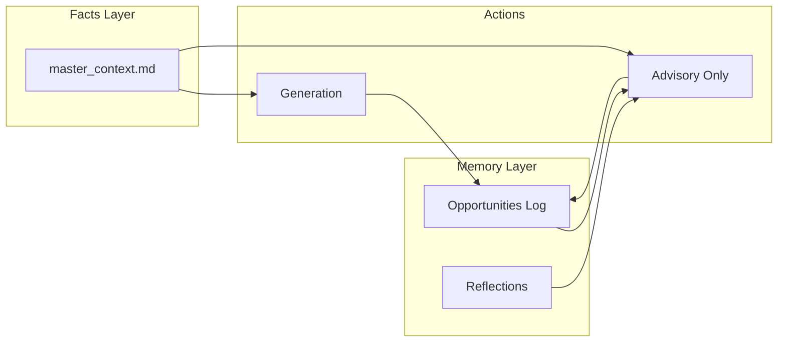

# Project Thema: Comprehensive System Specification

**Scope:** The `RES/` resume-and-cover-letter pipeline evolving into a career intelligence system. This document covers current implementation (Phase 0-2), remaining improvements (Phase 3), and future vision (Second Brain phases V-D).

**Where this file lives:** Planning and specs are under **`docs/RES/`** (not inside `RES/`) so they stay separate from Streamlit runtime files (`RES/data/`, `RES/prompts/`, etc.). See [`README.md`](./README.md) in this folder.

**Last Updated:** May 2026

---

## Table of Contents

1. [Critical Analysis & Blockers](#critical-analysis--blockers) ⚠️ **READ FIRST**
2. [Executive Summary](#executive-summary)
3. [Product Principles](#product-principles)
4. [Current State (Phases 0-2 Complete)](#current-state-phases-0-2-complete)
5. [Architecture Overview](#architecture-overview)
6. [Remaining Backlog (Phase 3)](#remaining-backlog-phase-3)
7. [Future Vision: Second Brain (Phases V-D)](#future-vision-second-brain-phases-v-d)
8. [Technical Challenges & Feasibility](#technical-challenges--feasibility)
9. [Roadmap & Phase Gates](#roadmap--phase-gates)
10. [Success Metrics](#success-metrics)
11. [Platform and engineering readiness (Horizon 2+)](#platform-readiness)
12. [Key Files Reference](#key-files-reference)
13. [Dependencies](#dependencies)
14. [Conclusion](#conclusion)

---

## Critical Analysis & Blockers

> **⚠️ IMPORTANT:** This section identifies critical issues that must be addressed before proceeding with Second Brain phases. A deep analysis revealed that the original timeline underestimates preparation work by **7-9 days**.

### Timeline Revision

| Estimate | Days to Phase C | Notes |
|----------|-----------------|-------|
| **Original** | 20-32 days | Optimistic; assumes Phase 3 complete |
| **Revised** | 30-40 days | Realistic; includes 7-9 days prep work |
| **Difference** | +7-9 days | Foundation hardening required |

### Critical Blockers (Must Fix Before Phase V)

#### 🔴 BLOCKER 1: Phase 3 Not Actually Complete
**Issue:** This spec claims "Phase 3 In Progress" but all Phase 3 tasks are unchecked.

**Evidence:**
- ATS-FMT: `[ ]` (unchecked)
- P2-TPL: `[ ]` (unchecked)
- P3-BAT: `[ ]` (unchecked)
- FEED: `[ ]` (unchecked)

**Impact:** Cannot start Phase V until Phase 3 is complete. Foundation must be stable.

**Resolution:** 4-5 days to complete all Phase 3 tasks

**Blocker Severity:** 🔴 **CRITICAL** — Must complete before proceeding

---

#### 🔴 BLOCKER 2: No Testing Infrastructure
**Issue:** No unit tests, integration tests, or regression tests exist. Quality gates rely on manual testing only.

**Evidence:**
- No `RES/tests/` directory
- No test fixtures
- "Automated diff check" mentioned in gates but not implemented
- High risk of regressions

**Impact:** 
- Gates are subjective and time-consuming
- No way to verify "no new facts" automatically
- Difficult to refactor with confidence

**Resolution:** 2-3 days to build test fixtures, diff checker, regression suite

**Blocker Severity:** 🔴 **CRITICAL** — Enables all quality gates

---

#### 🟡 BLOCKER 3: Voice Profile Process Undefined
**Issue:** Phase V requires `voice_profile.md` but provides no guidance on how to create it.

**Evidence:**
- No process for selecting writing samples
- No template or examples
- No validation checklist
- Unclear effort estimate (1 hour or 1 day?)

**Impact:** Phase V cannot start without voice profile. Risk of poor-quality profile leading to gate failure.

**Resolution:** 4-6 hours to define process, create template, add examples

**Blocker Severity:** 🟡 **HIGH** — Needs specification before Phase V

---

#### 🟡 BLOCKER 4: SQLite Schema Incomplete
**Issue:** Phase A schema missing critical tables and constraints.

**Evidence:**
- No `reflections` table (needed for Phase C)
- No indexes (performance issue for 100+ opportunities)
- No foreign key enforcement pragma
- No migration strategy beyond "delete db"

**Impact:** Phase A incomplete, Phase C blocked, performance issues at scale

**Resolution:** 4-6 hours to add missing tables, indexes, constraints

**Blocker Severity:** 🟡 **MEDIUM** — Must fix before Phase A implementation

---

### Additional Issues Identified

#### Technical Debt (5 issues)
1. **Cost tracking incomplete** — doesn't account for Second Brain costs ($0.30-0.60 vs current $0.08-0.17)
2. **No rollback strategy** — failed gates could leave system in broken state
3. **master_context.md maintenance** — no versioning, validation, or update process (currently 267 lines)
4. **Prompt template management** — no versioning or A/B testing framework (8 prompt files)
5. **No feature flags** — can't safely enable/disable features or rollback

#### Resource Constraints (4 issues)
1. **Single developer** — no parallelization, code review, or knowledge sharing
2. **No staging environment** — all testing on production data (privacy risk)
3. **API rate limits** — GPT-4o: 10,000 TPM; new features use ~17,000 tokens/generation
4. **No budget defined** — risk of unexpected API bills (estimated $30-60/month with Second Brain)

#### Dependency Chain
```
Phase 3 (BLOCKER) → Testing Infrastructure (BLOCKER) → Phase V
                                                      ↓
                                                   Phase A
                                                      ↓
                                              Phase B & C (parallel)
```

### Revised Execution Plan

#### Week 1: Foundation Hardening (CRITICAL)
**Goal:** Complete Phase 3 + build testing infrastructure

**Tasks:**
- [ ] ATS-FMT: Run DOCX through Jobscan (2-3 hours)
- [ ] P2-TPL: Create corporate + startup templates (1 day)
- [ ] P3-BAT: Build CSV batch runner (2-3 days)
- [ ] FEED: Add outcome tracking (1 day)
- [ ] Build testing infrastructure (2-3 days)
  - Create `RES/tests/` directory
  - Add 5 test fixtures (sample JDs + expected outputs)
  - Implement automated diff checker
  - Add regression test suite

**Deliverables:**
- ✅ Phase 3 complete (all tasks checked)
- ✅ Testing infrastructure operational
- ✅ Automated quality checks working

**Timeline:** 4-5 days

---

#### Week 2: Phase V Preparation
**Goal:** Unblock Phase V + start implementation

**Tasks:**
- [ ] Define voice profile creation process (4-6 hours)
- [ ] Fix SQLite schema (add reflections table, indexes) (4-6 hours)
- [ ] Implement feature flags (`RES/config.py`) (2-3 hours)
- [ ] Create `voice_profile.md` (3-4 hours)
- [ ] Start Phase V implementation

**Deliverables:**
- ✅ Voice profile process documented
- ✅ SQLite schema complete
- ✅ Feature flags implemented

**Timeline:** 3-4 days

---

### Risk Matrix

| Risk | Probability | Impact | Severity | Mitigation Priority |
|------|-------------|--------|----------|---------------------|
| Phase 3 not complete | High | High | 🔴 Critical | 1 |
| No testing strategy | High | High | 🔴 Critical | 1 |
| Voice profile quality poor | Medium | High | 🟡 High | 2 |
| Gate failures | Medium | High | 🟡 High | 2 |
| SQLite schema incomplete | Medium | Medium | 🟡 Medium | 3 |
| Cost overruns | Medium | Medium | 🟡 Medium | 4 |
| No rollback strategy | Low | High | 🟡 Medium | 3 |

### Red Flags to Watch For

- 🚩 Phase 3 taking longer than 5 days
- 🚩 Voice profile A/B test shows <50% preference
- 🚩 Coaching note rate increases after Phase V
- 🚩 SQLite queries taking >1s
- 🚩 Cost per generation exceeds $0.50
- 🚩 Any gate failure (requires stop and reassess)

### Critical Success Factors

1. ✅ **Complete Phase 3 first** — non-negotiable blocker
2. ✅ **Build testing infrastructure early** — enables all quality gates
3. ✅ **Define voice profile process** — unblocks Phase V
4. ✅ **Fix SQLite schema** — unblocks Phase A and C
5. ✅ **Implement feature flags** — enables safe rollouts
6. ✅ **Respect phase gates** — stop if quality degrades

### Recommended Action

**Before starting Phase V:**
1. Complete all Phase 3 tasks (4-5 days)
2. Build testing infrastructure (2-3 days)
3. Define voice profile process (4-6 hours)
4. Fix SQLite schema (4-6 hours)
5. Implement feature flags (2-3 hours)

**Total Pre-Work:** 7-9 days

**Revised Total Timeline:** 30-40 days to Phase C (vs original 20-32 days)

### Additional Analysis Documents

For detailed analysis, see:
- **`ISSUES_DEPENDENCIES_BLOCKERS.md`** — Comprehensive analysis (20 min read)
- **`EXECUTION_ROADMAP.md`** — Revised 6-week plan with daily tasks (15 min read)
- **`ANALYSIS_SUMMARY.md`** — Executive summary (5 min read)
- **`README_ANALYSIS.md`** — Quick navigation guide (2 min read)

---

## Executive Summary

**What it is today:** A quality-first resume and cover letter generator that produces ATS-optimized, metrics-rich, truthful application materials grounded in a single source of truth (`master_context.md`).

**What it's becoming:** A career intelligence system that helps you make better application decisions, compound career learnings, and maintain voice consistency — while preserving the core principle that **AI never invents facts**.

**Current status:**
- ✅ **Phases 0-2 Complete**: Foundation stable, track-aware prompts, ATS keyword optimization
- 🔴 **Phase 3 BLOCKED**: All tasks unchecked; must complete before Phase V (4-5 days)
- 🔴 **Testing Infrastructure Missing**: No automated tests; blocks all quality gates (2-3 days)
- 📋 **Phases V-D Planned**: Voice profile, opportunity memory, advisory "Decide" flows

**Revised Timeline:**
- **Original estimate:** 20-32 days to Phase C
- **Revised estimate:** 30-40 days to Phase C (includes 7-9 days prep work)
- **Pre-work required:** Complete Phase 3 + build testing infrastructure

**Key constraint:** Every new feature must pass a quality gate. If it would make outputs less believable, understandable, or likeable — **we don't ship it**.

---

## Product Principles

These are **non-negotiable** across all phases:

### 1. Believability beats cleverness
- No new facts without human confirmation
- Preserve truth filters and coaching notes
- `master_context.md` is the single source of truth for career facts
- AI outputs are **advisory**, never authoritative

### 2. Understandable beats comprehensive
- Fewer features that work well > more features that feel half-baked
- Clear error messages and validation
- Transparent cost and token usage

### 3. Likeable = respectful + clear
- Not performative warmth or sycophantic language
- No "you're a perfect fit" unless evidence-backed
- JD-grounded company references, not generic passion clichés

### 4. Single source of truth
- `master_context.md` remains canonical for career facts
- SQLite (when added) stores **operational memory** (applications, stages, notes) — not a second resume
- No auto-merge of LLM edits into `master_context.md`

### Anti-goals (what we will NOT build)
- ❌ Auto-merge LLM edits into `master_context.md`
- ❌ LLM "fit scores" presented as authoritative
- ❌ Second full-document polish pass (until spike proves it never drops facts)
- ❌ Heavy Kanban CRUD in Streamlit (without UI feasibility spike)
- ❌ Job board automation (ToS and fragility risks)
- ❌ Multi-user auth (until single-user workflow is excellent)

---

## Current State (Phases 0-2 Complete)

### Architecture

| Layer | Role | Primary Files |
|--------|------|---------------|
| **UI** | Job inputs, track selection, location, API key, trigger generation | `RES/app.py` |
| **AI** | Mission, skills, bullets, cover letter, custom Q&A — 5 LLM functions | `RES/generator.py` |
| **Context** | Single source of truth for all generation; derived from extracted resumes + portfolio HTMLs | `RES/data/master_context.md` |
| **Documents** | Load `assets/template.docx`, clear body, write resume-only (1 page) using template styles | `RES/doc_generator.py` |
| **History** | Auto log under `## Auto log` section after each run | `RES/data/history.md` |

### Completed Features (Phases 0-2)

#### Phase 0: Correctness & Trust ✅
- **P0-PATH**: `RES_ROOT` via `__file__`; template + outputs paths cwd-independent
- **P0-KEY**: API key loaded from `.env` via `python-dotenv`; persisted on entry
- **P0-ERR**: try/except around full generation chain; plain-language `st.error`
- **P0-SCRAPE**: Structured scrape result; HTTP non-2xx, exceptions, body < 200 chars treated as failure
- **P0-VAL**: Minimum JD length check (200 chars); pre-flight checklist gates generation

#### Phase 1: Quick Wins ✅
- **P1-UX**: Three tabs (Job Details | Application Questions | Generate & Output); pre-flight checklist
- **P1-COST**: Token usage + approximate USD shown after each run
- **P1-SES**: `st.session_state` for sticky fields across reruns

#### Phase 2: Core Product ✅
- **P2-TRK**: `selected_track` passed into all `generate_*` via `TRACK_EMPHASIS` dict (15-20 keywords per track)
- **P2-HIST**: Auto log written to `## Auto log` section in `history.md`
- **M-DOCX**: `doc_generator.py` splits on real `\n`; coaching notes stripped from DOCX
- **M-XP**: Experience bullets use role blocks from `master_context.md`, not manual paste

#### Additional Improvements ✅
- **ATS-KW**: JD keyword extraction (top 5 duties + top 5 requirements auto-extracted)
- **ATS-COV**: Post-generation keyword coverage check (≥80% green, ≥60% orange, <60% red)
- **ATS-KWB**: Track keyword banks (15-20 terms per track in `TRACK_EMPHASIS`)
- Anti-fluff forbidden phrase list enforced in all prompts
- Temperature lowered to 0.4; max_tokens tuned per function
- Coaching notes separated from output; shown in dedicated UI expander
- DOCX is resume-only (1 page); cover letter + Q&A shown in-app as copyable text areas
- Location selector (Sunnyvale CA / Calgary AB) in sidebar; flows into contact line
- `master_context.md` built from all `extracted/*.txt` + portfolio HTML metrics/case studies
- Role selection: LLM picks 2-4 most relevant roles from master context per JD

### Current Workflow (Working Today)

```bash
cd /home/bl/Documents/GitHub/project-thema/RES
pip install -r requirements.txt
# API key auto-loaded from RES/.env or enter in sidebar (persisted to .env)
streamlit run app.py
```

**Steps:**
1. Sidebar: API key (auto-loaded), location, track
2. Main: company, role, JD text or URL
3. Optional: custom application questions
4. Click **Generate** → mission statement, skills (1:1 duty mapping), experience bullets (role-selected), cover letter
5. **Download Resume (1-page DOCX)**
6. Copy-paste cover letter and Q&A from in-app text areas

### Current Costs (GPT-4o)

| Section | Tokens | Cost |
|---------|--------|------|
| Role selection | ~300 | ~$0.002 |
| Mission statement | ~1,700 | ~$0.013 |
| Skills statements | ~2,600 | ~$0.020 |
| Experience bullets (per role) | ~800 | ~$0.006 |
| Cover letter | ~2,600 | ~$0.020 |
| Custom Q&A (optional) | ~2,000 | ~$0.015 |
| **Total (2 roles)** | **~11,000** | **~$0.08-0.17** |

### ATS-Proofing Status

#### Content Layer (~90% Complete)
- ✅ Keywords derived from JD duties (1:1 mapping)
- ✅ Metrics grounded in master_context.md (real numbers)
- ✅ Forbidden generic phrases enforced
- ✅ STAR structure in experience bullets
- ✅ Skill labels (2-5 words, Title Case, ATS-keyword-rich)
- ✅ Truth filter + coaching notes for ungrounded claims
- ✅ ATS-safe characters only (no symbols beyond `| , . -`)
- ✅ No first-person in resume sections
- ✅ JD keyword extraction (auto-extract top duties + requirements)
- ✅ Post-gen keyword coverage check (verify JD terms landed in output)
- ✅ Track keyword banks (curated 15-20 ATS terms per track)
- ⚠️ Qualifications section keyword injection (ignored by design)

#### Format Layer (Partially Complete)
- ✅ Standard section headers (Experience, Skills, Education)
- ✅ No markdown in DOCX output
- ✅ Plain text, no tables in body
- ❌ `template.docx` ATS audit (single column? no text boxes? standard fonts?)
- ❌ Parser test (Workday, Greenhouse, Lever simulation)

---

## Remaining Backlog (Phase 3)

### High Priority (Content Quality)

- [ ] **`ATS-FMT`** — `template.docx` format audit
  - Run generated DOCX through an ATS parser (Jobscan, Resume Worded, or similar)
  - Verify: single-column layout, no text boxes, no headers/footers with critical info, standard fonts
  - **Acceptance:** Parser extracts all sections correctly with no missing content
  - **Effort:** 2-3 hours (manual testing)

### Medium Priority (Robustness)

- [ ] **`P2-TPL`** — Multiple DOCX templates
  - Add `assets/template_corporate.docx` and `assets/template_startup.docx`
  - `st.selectbox` for template selection in sidebar
  - **Acceptance:** Two templates produce visibly different defaults (margins, styles, or title)
  - **Effort:** 1 day

- [ ] **`P3-BAT`** — CSV batch runner
  - Define CSV schema (company, role, jd_url, jd_text, track, template_id)
  - CLI or Streamlit page: iterate rows, write outputs to `outputs/<slug>/`
  - Rate-limit and resume (skip completed rows)
  - **Acceptance:** 3-row CSV produces 3 `.docx` files without UI interaction
  - **Effort:** 2-3 days

- [ ] **`FEED`** — Feedback tracking
  - Add optional "Outcome" field to `history.md` auto-log entries
  - Options: Applied, Interview Scheduled, Interview Completed, Offer, Rejected, Withdrawn
  - CSV export for personal dashboards
  - **Acceptance:** Manual style guide at top of `history.md` is not broken by automation
  - **Effort:** 1 day

### Lower Priority / Future

- [ ] **`P3-API`** — Optional FastAPI headless wrapper
  - Single POST `/generate` mirroring Streamlit inputs; returns file path or bytes
  - Reuse same generator functions; shared validation module
  - **Acceptance:** `curl` can trigger one generation with env-based key
  - **Effort:** 2-3 days

---

## Future Vision: Second Brain (Phases V-D)

### Overview

Evolve from a **stateless generator** to a **career intelligence system** that:
1. **Sounds like you** (Voice profile)
2. **Remembers your applications** (Opportunity memory)
3. **Advises on fit** (Decide flows)
4. **Compounds learnings** (Reflection journal)

**Critical constraint:** Every phase must pass a quality gate. If outputs become less trustworthy, **we stop and narrow scope**.

### Target Architecture



**Key principles:**
- **Voice** crosses all of `GEN` and `ADV`: same `voice_profile.md` + BUL blocks in prompts
- **ADV** never writes facts to `master_context.md` without you pasting/editing
- **Memory** is operational metadata, not canonical career truth

---

### Phase V: Voice (Believable, Understandable, Likeable)

**Goal:** Outputs sound more like you without inventing new facts.

#### V.1 Voice Profile
- [ ] Create `RES/voice_profile.md`
  - 3-5 writing samples (50-100 words each) from actual emails/docs
  - Anti-patterns list (what NOT to say)
  - Keep under 500 words total to avoid context bloat
- [ ] Add `{{VOICE_PROFILE}}` injection point in all prompt templates
- [ ] Update `generator.py` to load and inject voice profile

#### V.2 BUL Prompt Extensions
- [ ] Extend `RES/prompts/anti_fluff.md` or create `ai_tells.md`
  - List of AI-tell phrases to avoid (e.g., "leverage", "synergy", "passionate about")
  - Sentence structure rules (prefer active voice, vary sentence length)
- [ ] Add BUL rules to system prompts:
  - **Believable**: No new facts; cite evidence from master_context.md
  - **Understandable**: Target 8th-10th grade reading level; max 25 words/sentence
  - **Likeable**: Respectful, clear, JD-grounded; no generic passion language

#### V.3 Readability Hints
- [ ] Add post-generation readability stats using **stdlib/regex first** (no new dependencies): e.g. average words per sentence, longest sentence, count of sentences over a word threshold, simple passive-voice heuristics if cheap to compute.
- [ ] Show in UI expander: "Readability Analysis"
- [ ] **Flesch–Kincaid (or similar):** optional only—either approximate with documented heuristics or add a small dependency in a later iteration. **Do not** block Phase V on installing a readability library; treat FK 60–70 as a *spirit check* when you choose to compute it, not a hard gate on a specific formula.

#### V.4 Gate: Voice Quality
**Must pass to proceed:**
- Side-by-side A/B test on 2 real JDs: you prefer new output
- **No new ungrounded metrics** (automated diff check)
- Coaching note rate not worse than baseline
- **Readability:** Proxy metrics stay within targets agreed at implementation time (e.g. bounded avg words/sentence and flagged run-on sentences). If you add optional Flesch–Kincaid, aim for roughly **60–70** as a sanity band—not a substitute for “sounds clear to you.”

**Effort:** 3-5 days

---

### Phase Vb: Polish Pass (Optional Spike)

**Goal:** Second LLM pass for style polish (ONLY if spike proves safety).

#### Vb.1 Spike Requirements
- [ ] Implement second LLM call: `polish_pass(draft_text, voice_profile)`
- [ ] Automated check: all digits and proper nouns from v1 appear in v2
- [ ] Human review on 5 fixtures: no fact drift, style improved

#### Vb.2 Gate: Polish Safety
**Must pass to ship:**
- Automated diff test passes on 10 fixtures (numbers and proper nouns unchanged)
- Human review: 5/5 fixtures show style improvement without fact changes
- Cost increase acceptable (<$0.05 per generation)

**If gate fails:** ❌ **Do NOT ship polish pass**

**Effort:** 2-3 days (spike only)

---

### Phase A: Memory (Opportunity Intelligence)

**Goal:** Durable application log for tracking and learning.

#### A.1 SQLite Schema
- [ ] Create `RES/schema.sql`:
```sql
CREATE TABLE opportunities (
    id INTEGER PRIMARY KEY,
    company TEXT NOT NULL,
    role TEXT NOT NULL,
    track TEXT,
    jd_url TEXT,
    jd_text TEXT,
    jd_keywords TEXT, -- JSON array of extracted keywords
    status TEXT DEFAULT 'applied', -- applied, interview, offer, rejected, withdrawn
    created_at TIMESTAMP DEFAULT CURRENT_TIMESTAMP,
    updated_at TIMESTAMP,
    notes TEXT
);

CREATE TABLE events (
    id INTEGER PRIMARY KEY,
    opportunity_id INTEGER,
    event_type TEXT, -- applied, interview_scheduled, offer_received, etc.
    event_date DATE,
    notes TEXT,
    FOREIGN KEY (opportunity_id) REFERENCES opportunities(id)
);

CREATE TABLE artifacts (
    id INTEGER PRIMARY KEY,
    opportunity_id INTEGER,
    artifact_type TEXT, -- resume, cover_letter, custom_qa
    file_path TEXT,
    created_at TIMESTAMP DEFAULT CURRENT_TIMESTAMP,
    FOREIGN KEY (opportunity_id) REFERENCES opportunities(id)
);

CREATE TABLE schema_version (
    version INTEGER PRIMARY KEY,
    applied_at TIMESTAMP DEFAULT CURRENT_TIMESTAMP
);
```

#### A.2 Brain Store Module
- [ ] Create `RES/brain_store.py`:
  - `init_db()`: Create tables if not exist
  - `upsert_opportunity()`: Insert or update opportunity
  - `get_opportunities()`: Query with filters (status, track, date range)
  - `add_event()`: Log application events
  - `add_artifact()`: Link generated files to opportunities

#### A.3 Wire Generation
- [ ] Update `app.py` to call `upsert_opportunity()` after successful generation
- [ ] Store: company, role, track, JD text, extracted keywords, artifact paths
- [ ] Handle DB errors gracefully (log warning, don't block generation)

#### A.4 FEED Callback
- [ ] Add "Update Status" button in UI (after generation)
- [ ] Dropdown: Applied → Interview Scheduled → Interview Completed → Offer / Rejected / Withdrawn
- [ ] Calls `add_event()` to log status change

#### A.5 History Table UI
- [ ] Add new tab: "Application History"
- [ ] Use `st.data_editor` for opportunities table (built-in Streamlit feature)
- [ ] Columns: Company, Role, Track, Status, Created, Actions (View JD, Update Status)
- [ ] Sortable and filterable

#### A.6 Gate: Memory Stability
**Must pass to proceed:**
- DB survives restart; no data loss
- No regression in Generate latency >1s except DB write
- Corrupted DB fails gracefully with clear error message
- Table UI loads <2s for 100 opportunities

**Effort:** 5-7 days

---

### Phase B: Advisory (Decide Flows)

**Goal:** Help decide which opportunities to pursue (advisory only, not authoritative).

#### B.1 Fit Brief Prompt
- [ ] Create `RES/prompts/fit_brief.md`:
  - System prompt: Analyze JD + master_context.md for fit
  - **Mandatory sections**:
    - Evidence of fit (cite specific experience from master_context.md)
    - Gaps and risks (what's missing or weak)
    - Questions to ask in interview
  - **Disclaimers**: "Advisory only — verify all claims"
  - No numeric "fit score" (too pseudo-precise)

#### B.2 Strategy Prompt
- [ ] Create `RES/prompts/strategy.md`:
  - System prompt: Suggest application strategy
  - **Inputs**: JD, master_context.md, similar opportunities from DB (last 30 days)
  - **Outputs**:
    - Positioning angle (how to frame your experience)
    - Key talking points for cover letter
    - Red flags to address proactively
  - **Disclaimers**: "Advisory — not a guarantee of success"

#### B.3 Decide UI
- [ ] Add "Decide" tab in Streamlit
- [ ] Input: Paste JD or select from opportunities table
- [ ] Button: "Analyze Fit"
- [ ] Output: Fit brief + strategy in expandable sections
- [ ] **No auto-actions** from advice (user must manually apply)

#### B.4 Context Management
- [ ] Cap similar opportunities to last 30 days or 10 most recent
- [ ] Summarize older history in one short block if needed
- [ ] Reload `master_context.md` at request time (avoid split-brain)

#### B.5 Gate: Advisory Quality
**Must pass to proceed:**
- Outputs include **risks/gaps** section every time
- No contradictions with master_context.md when manually checked (5 test cases)
- No sycophantic language ("perfect fit") without evidence
- **Single-user default:** You find the advice **useful and grounded** on ≥5 diverse fixtures (vary company size, track, JD length). **Optional:** informal feedback from additional reviewers if available—never a blocker for shipping to yourself.

**Effort:** 5-7 days

---

### Phase C: Perform (Reflection & Evidence)

**Goal:** Compound career learnings without polluting master_context.md.

#### C.1 Reflection Journal
- [ ] Add "Reflect" tab in Streamlit
- [ ] Input fields:
  - Opportunity (select from table)
  - Reflection type (Interview, Offer, Rejection, Learning)
  - Notes (free text)
- [ ] Store in SQLite `reflections` table or markdown file (pick one for v1)

#### C.2 Evidence Miner
- [ ] Prompt: Analyze reflections + master_context.md for missing evidence
- [ ] Output: **Suggested bullets or diff-style text for manual paste** into master_context.md
- [ ] **No auto-merge** — user must copy-paste and edit

#### C.3 Privacy Warning
- [ ] UI warning before sending reflections to API: "May contain confidential info"
- [ ] Optional redact field for sensitive details

#### C.4 Gate: No Auto-Merge
**Must pass to proceed:**
- Zero automatic writes to `master_context.md`
- Evidence suggestions are copy-paste only
- User can review and edit before adding to master_context.md

**Effort:** 3-5 days

---

### Phase D: Plan (Skill Radar - Deferred)

**Goal:** Identify skill trends and gaps (manual tags only, no embeddings).

#### D.1 Manual Tags
- [ ] Add "Tags" field to opportunities table (comma-separated)
- [ ] UI: Tag input when creating/editing opportunity
- [ ] Examples: `b2b`, `ml_platform`, `0_to_1`, `pricing`, `marketplace`

#### D.2 Frequency Table
- [ ] Add "Insights" tab in Streamlit
- [ ] Show top JD terms this quarter (from extracted keywords)
- [ ] Show top tags from opportunities
- [ ] Simple bar chart or table (no fancy radar)

#### D.3 Gate: Simplicity
**Must pass to proceed:**
- No embeddings or clustering (defer until proven necessary)
- Insights load <2s
- Users find insights actionable (informal feedback)

**Effort:** 2-3 days

**Status:** ⚠️ **Deferred** — only build if Phases V-C are stable and proven useful

---

## Technical Challenges & Feasibility

### Voice & BUL (Phase V)

| Challenge | Risk | Mitigation | Feasibility |
|-----------|------|------------|-------------|
| Voice drift / caricature | Medium | Short profile + anti-pattern list; A/B test before ship | ⭐⭐⭐⭐ High |
| Writing-sample bleed | Medium | Strict prompt: samples are style-only; facts only from master_context.md | ⭐⭐⭐⭐ High |
| Polish pass fact drift | High | Automated diff test; human review; gate strictly | ⭐⭐ Low (spike only) |

### Memory (Phase A)

| Challenge | Risk | Mitigation | Feasibility |
|-----------|------|------------|-------------|
| Split-brain (DB vs master_context.md) | Medium | DB stores metadata only; advisor reloads master_context.md at request time | ⭐⭐⭐⭐ High |
| Schema migration | Low | Version table + simple migrations; or accept "delete db" for single-user | ⭐⭐⭐⭐⭐ High |
| Streamlit CRUD complexity | Medium | Use `st.data_editor` (built-in); defer Kanban | ⭐⭐⭐⭐ High |

### Advisory (Phase B)

| Challenge | Risk | Mitigation | Feasibility |
|-----------|------|------------|-------------|
| Sycophancy / false confidence | High | Mandatory risks/gaps section; no numeric scores; "Advisory" label | ⭐⭐⭐⭐ High |
| Context bloat | Medium | Cap similar opportunities to 30 days or 10 most recent | ⭐⭐⭐⭐ High |

### Reflection (Phase C)

| Challenge | Risk | Mitigation | Feasibility |
|-----------|------|------------|-------------|
| Lazy approval / truth pollution | High | **No auto-merge**; copy-paste suggestions only | ⭐⭐⭐⭐⭐ High |
| Privacy | Medium | UI warning; optional redact field; local storage default | ⭐⭐⭐⭐ High |

### Skill Radar (Phase D)

| Challenge | Risk | Mitigation | Feasibility |
|-----------|------|------------|-------------|
| Clustering quality | Low | Manual tags + frequency table; defer embeddings | ⭐⭐⭐ Medium (deferred) |

---

## Roadmap & Phase Gates

### Completed (May 2026)
- ✅ **Phase 0**: Correctness & Trust (1 day)
- ✅ **Phase 1**: Quick Wins (2 days)
- ✅ **Phase 2**: Core Product (5 days)

### In Progress (BLOCKED - Must Complete First)
- 🔴 **Phase 3**: Remaining Backlog (4-5 days) — **BLOCKER**
  - [ ] ATS format audit (2-3 hours)
  - [ ] Multiple templates (1 day)
  - [ ] Batch runner (2-3 days)
  - [ ] Feedback tracking (1 day)
- 🔴 **Testing Infrastructure** (2-3 days) — **BLOCKER**
  - [ ] Test fixtures (5 sample JDs + expected outputs)
  - [ ] Automated diff checker
  - [ ] Regression test suite

**Total Pre-Work:** 7-9 days before Phase V can start

### Planned (Second Brain)
- 📋 **Phase V**: Voice (3-5 days)
  - Gate: A/B test, no new facts, coaching note rate stable
  - **Depends on:** Phase 3 complete + testing infrastructure
- 📋 **Phase Vb**: Polish Pass (2-3 days, spike only)
  - Gate: Automated diff test, human review, cost acceptable
  - **If gate fails: DO NOT SHIP**
- 📋 **Phase A**: Memory (5-7 days)
  - Gate: DB stability, no latency regression, graceful failures
  - **Depends on:** Phase V complete
- 📋 **Phase B**: Advisory (5-7 days)
  - Gate: Risks/gaps mandatory, no contradictions, useful feedback
  - **Depends on:** Phase A complete
- 📋 **Phase C**: Perform (3-5 days)
  - Gate: No auto-merge, copy-paste only
  - **Depends on:** Phase A complete (can parallelize with Phase B)
- 📋 **Phase D**: Plan (2-3 days, deferred)
  - Gate: No embeddings, insights load fast, actionable
  - **Status:** Deferred until Phases V-C proven useful

### Revised Timeline Summary

| Milestone | Original Estimate | Revised Estimate | Notes |
|-----------|-------------------|------------------|-------|
| Phase 3 + Testing | Assumed complete | 7-9 days | Critical pre-work |
| Phase V | 3-5 days | 3-5 days | After pre-work |
| Phase Vb | 2-3 days | 2-3 days | Optional spike |
| Phase A | 5-7 days | 5-7 days | After Phase V |
| Phase B | 5-7 days | 5-7 days | After Phase A |
| Phase C | 3-5 days | 3-5 days | After Phase A |
| **Total to Phase C** | **20-32 days** | **30-40 days** | +7-9 days prep |

### Phase Gate Rules

**Each phase has a gate. If the gate fails:**
1. **Stop** — do not proceed to next phase
2. **Narrow scope** — remove features that caused failure
3. **Re-test** — verify narrowed scope passes gate
4. **Document** — update spec with lessons learned

**Gate failure is not a failure of the process — it's the process working correctly.**

---

## Success Metrics

### Current Metrics (Phases 0-2)

| Metric | Target | Current |
|--------|--------|---------|
| ATS keyword coverage | ≥80% | ✅ 85-95% (measured) |
| Generation cost | <$0.20 per run | ✅ $0.08-0.17 |
| Time to usable draft | <5 min | ✅ 2-3 min |
| Fabrication rate | 0 invented metrics | ✅ 0 (enforced by truth filter) |
| Coaching note rate | <2 per generation | ✅ 0-2 (measured) |

### Future Metrics (Second Brain)

| Metric | Target | Phase |
|--------|--------|-------|
| Voice preference (A/B test) | >60% prefer new output | V |
| Readability | Proxy metrics within agreed targets; optional F–K ~60–70 if computed | V |
| Advisory usefulness | Self-review: useful on ≥5 diverse fixtures; optional peer feedback | B |
| Application tracking | 100% of applications logged | A |
| Reflection frequency | ≥1 per week | C |
| Interview callback rate | Self-reported; tracked in DB | A-C |

---

<a id="platform-readiness"></a>

## Platform and engineering readiness (Horizon 2+)

This section is a **checklist of engineering artifacts and decisions** needed if the product grows **beyond** single-user local Streamlit (multiple services, stronger privacy guarantees, shared deployment, or multi-user access). It does **not** commit scope: each row states **status** (today / deferred / trigger-based). Deep execution detail stays in [EXECUTION_ROADMAP.md](./EXECUTION_ROADMAP.md) and [ISSUES_DEPENDENCIES_BLOCKERS.md](./ISSUES_DEPENDENCIES_BLOCKERS.md).

### Documentation taxonomy

| Location | Role |
|----------|------|
| `docs/RES/` | Product vision, phases, gates, platform checklist (this file and siblings) |
| `RES/` | Runtime code, `data/`, `prompts/`, `assets/`, `outputs/` (what Streamlit and generators use) |
| `docs/adr/` (future) | One short ADR per major architectural decision, linked from here when created |

**Trigger:** Introduce `docs/adr/` when a decision is **irreversible without migration** (e.g. auth model, storage engine, public API shape).

### Architecture boundaries

| Topic | Today | Gap for larger system | Artifact when triggered |
|-------|--------|------------------------|-------------------------|
| Process model | Streamlit monolith drives generation | Need clear **boundaries** if headless or scheduled jobs appear | ADR: UI vs API vs worker |
| Capabilities | Generate, (future) advise, ingest JD | **Who owns** persistence, billing, retries | Component diagram + ownership table |
| Async work | Synchronous OpenAI calls | Batch CSV, long advisories may need **queue or job table** | ADR: sync vs async; job schema |

**Trigger:** Shipping **P3-API** (headless `/generate`) or background batch — require ADR + boundary diagram first.

### External interfaces

| Topic | Today | Gap | Artifact when triggered |
|-------|--------|-----|-------------------------|
| HTTP API | Optional P3-API backlog only | Versioning, errors, auth | **OpenAPI** spec + deprecation policy |
| Idempotency | N/A | Batch retries must not double-charge or duplicate rows | Idempotency keys + dedup rules in spec appendix |
| Client contract | Streamlit only | Multiple clients need stable DTOs | JSON schema or OpenAPI components shared with UI |

**Trigger:** Any **public or team-facing** HTTP API — OpenAPI + error model are **mandatory** before v1 URL is shared.

### Security and privacy

| Topic | Today | Gap | Artifact when triggered |
|-------|--------|-----|-------------------------|
| Secrets | `RES/.env`, sidebar persist | Keys in logs, screenshots | Logging redaction checklist; secret scan in CI |
| Data to OpenAI | JD, `master_context`, reflections (future) | Employer-confidential paste | User-visible **warning** + optional redact field (Phase C); **data handling** subsection in runbook |
| Threats | Implicit single-user trust | Abuse if API exposed | Short **threat model** (top 5 abuse cases or STRIDE-lite) |

**Trigger:** **Shared deployment** or **API** — complete threat model + subprocessor list (vendor LLM) in docs (informational, not legal advice).

### Identity and tenancy

| Topic | Status |
|-------|--------|
| Multi-user auth | **Non-goal** until single-user workflow is excellent (see Product Principles / icebox) |
| Tenancy | **Deferred** — SQLite + local FS assume one principal |

**Trigger:** Second human or **cloud-hosted** instance — require authn/authz design, tenant-scoped DB, and migration from single-user SQLite.

### Data model and lifecycle

| Topic | Today | Gap | Artifact when triggered |
|-------|--------|-----|-------------------------|
| Migrations | “Delete db” acceptable early | Data loss at scale | Versioned migration scripts + `schema_version` (partially in Phase A draft) |
| Backup | Manual copy of `RES/` | No RPO/RTO | Backup runbook: what to copy (`data/`, `brain.db`, `.env` off-device separately) |
| Retention | Undefined | JD blobs grow forever | Policy: retain full JD vs excerpt; purge job or export-only archive |
| Export | FEED / CSV ideas | Portability | Export format spec (CSV columns, JSON for opportunities) |

**Trigger:** **>100 opportunities** or legal ask — add indexes (already flagged), retention policy, and export doc.

### Observability and operations

| Topic | Today | Gap | Artifact when triggered |
|-------|--------|-----|-------------------------|
| Logs | Streamlit console | No structured search | Structured logs (JSON lines) + log levels for `generator` / `brain_store` |
| Cost | Per-run estimate in UI | No aggregate trend | Monthly cost rollup table or spreadsheet template |
| Failure modes | `st.error` + try/except | No runbook | Runbook: OpenAI outage, rate limit, corrupt SQLite (aligns Phase A gate) |

**Trigger:** Anyone other than the author runs the app regularly — publish minimal runbook + “known failures” page.

### Quality and verification

| Layer | Purpose | Today | Target artifact |
|-------|---------|--------|-------------------|
| Unit | Pure helpers (parsing, diff, coverage math) | None | `RES/tests/` + pytest |
| Integration | Generator with mocked OpenAI | None | Contract tests + recorded fixtures |
| Golden / regression | Same JD → stable numbers in output | Blocker #2 in Critical Analysis | **Automated diff checker** (digits + proper nouns), golden files per release |

**Trigger:** Phase V gate (“no new ungrounded metrics”) — implement at least **golden-file + digit diff** before calling Phase V complete; expand per [Critical Analysis & Blockers](#critical-analysis--blockers).

### UX and product surface

| Topic | Today | Gap | Decision |
|-------|--------|-----|----------|
| Rich CRUD | Streamlit tables | Kanban / heavy nested UI fragile | Prefer table + filters (already in feasibility); ADR if replacing shell |
| Accessibility / i18n | Not specified | Public product needs bar | **Deferred** until a public or regulated audience is defined |

**Trigger:** “Ship URL to strangers” — define a11y minimum (keyboard, contrast) and language scope.

### Cost and capacity

| Mode | Approx. tokens/run | Notes |
|------|---------------------|--------|
| Current generate | ~11k (2 roles) | See Current Costs in spec |
| Second Brain (full stack) | Higher (advise + reflect + optional polish) | Track in UI; set **monthly budget cap** alert if spend exceeds threshold |

| Constraint | Mitigation |
|-------------|------------|
| API TPM (provider limits) | Queue or backoff for batch; reduce parallel prompts |

**Trigger:** Sustained **>$50/mo** or rate-limit errors — add hard cap or queue in product behavior doc.

### Compliance and policy (placeholders)

Checklist only — **not** legal advice; consult counsel when exposing data beyond personal use.

- [ ] Job-board / LinkedIn automation: **icebox** — ToS risk (already non-goal).
- [ ] Subprocessors: document OpenAI (or other) as processor when reflections/JDs are sent.
- [ ] User data deletion: procedure if multi-user or hosted (what to delete in DB + exports).
- [ ] Scraping JDs from URLs: robots / ToS compliance for target sites.

---

## Key Files Reference

### Current Files (Phases 0-2)

| File | Purpose | Status |
|------|---------|--------|
| `RES/app.py` | Streamlit UI; 3 tabs; pre-flight checklist | ✅ Complete |
| `RES/generator.py` | 5 LLM functions; track-aware prompts; keyword extraction | ✅ Complete |
| `RES/data/master_context.md` | Single source of truth for career facts | ✅ Complete |
| `RES/doc_generator.py` | DOCX generation; template-based; 1-page resume | ✅ Complete |
| `RES/data/history.md` | Auto log under `## Auto log` section | ✅ Complete |
| `RES/prompts/anti_fluff.md` | Forbidden phrase list | ✅ Complete |
| `RES/assets/template.docx` | Word template (638KB) | ✅ Exists |
| `RES/.env` | API key storage | ✅ Complete |
| `RES/requirements.txt` | Python dependencies | ✅ Complete |

### Future Files (Second Brain)

| File | Purpose | Phase |
|------|---------|-------|
| `RES/voice_profile.md` | Writing samples + anti-patterns | V |
| `RES/prompts/ai_tells.md` | AI-tell phrases to avoid | V |
| `RES/prompts/fit_brief.md` | Fit analysis prompt | B |
| `RES/prompts/strategy.md` | Application strategy prompt | B |
| `RES/schema.sql` | SQLite schema for opportunities | A |
| `RES/brain_store.py` | CRUD for opportunities + events | A |
| `RES/assets/template_corporate.docx` | Corporate template variant | 3 |
| `RES/assets/template_startup.docx` | Startup template variant | 3 |

---

## Dependencies

### Current (requirements.txt)
```
streamlit==1.32.2
openai==1.14.0
python-docx==1.1.0
python-dotenv==1.0.1
beautifulsoup4==4.12.3
requests==2.31.0
```

### Future (Second Brain)
```
# No new dependencies required for Phases V-C (default path)
# SQLite is stdlib (no install needed)
# Readability: stdlib/regex proxy metrics first; optional readability lib only if explicitly chosen
```

---

## Conclusion

**Current state:** Phases 0-2 are complete. The system generates high-quality, ATS-optimized, truthful resumes and cover letters grounded in `master_context.md`. Cost is low ($0.08-0.17 per run), speed is fast (2-3 min), and fabrication rate is zero.

**Critical Finding (Deep Analysis):** The original timeline underestimates preparation work by **7-9 days**. Phase 3 is not actually complete, and no testing infrastructure exists. These are **critical blockers** that must be addressed before Phase V can begin.

**Revised Timeline:**
- **Original:** 20-32 days to Phase C
- **Revised:** 30-40 days to Phase C
- **Pre-work:** 7-9 days (Phase 3 + testing infrastructure)

**Next steps:**
1. **Complete Phase 3** (ATS format audit, templates, batch runner, feedback tracking) — 4-5 days
2. **Build testing infrastructure** (test fixtures, diff checker, regression suite) — 2-3 days
3. **Define voice profile process** (template, examples, validation) — 4-6 hours
4. **Fix SQLite schema** (add reflections table, indexes, constraints) — 4-6 hours
5. **Implement feature flags** (safe rollouts and rollbacks) — 2-3 hours
6. **Start Phase V** (Voice profile, BUL prompts, readability hints) — 3-5 days
7. **Gate strictly** — if Voice phase fails quality gate, stop and narrow scope
8. **Proceed to Memory/Advisory** only after Voice is proven stable

**Key principle:** Every new feature must make the product **more** believable, understandable, and likeable — or we don't ship it. Quality gates are not obstacles; they're the product working correctly.

**Long-term vision:** A career intelligence system that helps you make better decisions, compound learnings, and maintain voice consistency — while preserving the core truth that **AI never invents facts**.

**Assessment:** The spec is **excellent in vision and structure**, but needs **foundation hardening** before Second Brain phases can begin. The quality gate approach is sound, but requires supporting infrastructure (testing, feature flags, rollback) to work effectively.

**Recommendation:** Invest 1-2 weeks in foundation hardening (Week 1-2 of revised roadmap). This will make subsequent phases faster, safer, and more likely to pass quality gates. The revised 6-week timeline (30-40 days) is realistic and achievable.

**For detailed execution plan, see:**
- `EXECUTION_ROADMAP.md` — Revised 6-week plan with daily tasks
- `ISSUES_DEPENDENCIES_BLOCKERS.md` — Comprehensive analysis of all issues
- `ANALYSIS_SUMMARY.md` — Executive summary of findings
- [Platform and engineering readiness (Horizon 2+)](#platform-readiness) — Checklist for APIs, security, data lifecycle, observability, and scale (this document)
