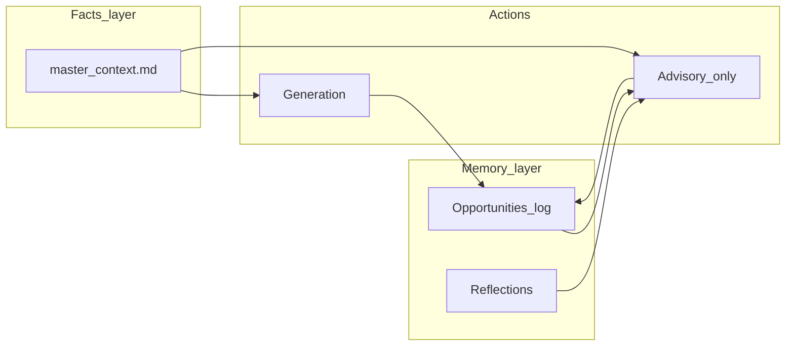

# RES second brain — restructured plan (quality-first)

## 1. Product principles (non-negotiable)

The product is **good** only if it **does not erode trust** in your materials or in your own judgment.

- **Believability beats cleverness:** No new facts without human confirmation. Preserve today’s truth filter and coaching-notes pattern.
- **Understandable beats comprehensive:** Fewer features that work well beat more features that feel half-baked, laggy, or contradictory.
- **Likeable = respectful + clear:** Not performative warmth; no sycophantic “you’re a perfect fit” unless evidence-backed.
- **Single source of truth:** `master_context.md` remains canonical for career facts. Anything in SQLite is **operational memory** (applications, stages, notes)—not a second resume.

**Anti-goals (avoid a bad product):**

- Do not auto-merge LLM edits into `master_context.md`.
- Do not present LLM “fit scores” or strategy as authoritative; label as **advisory** with visible limitations.
- Do not add a second full-document LLM pass (polish) until a spike proves it **never** drops numbers, names, or technical qualifiers.
- Do not build Kanban / heavy CRUD in Streamlit without a UI feasibility spike; default to **table + filters** first.

---

## 2. Current baseline

**Canonical implementation spec:** [SPEC.md](./SPEC.md) (Phases 0–3 + Second Brain V–D, backlog, dependencies). This plan is a **focused slice**: second-brain direction, quality gates, and feasibility—always defer to `SPEC.md` for checklists and file-level detail when they differ.

| Layer | Role | Primary files |
|--------|------|----------------|
| Facts | Grounded generation | [../../RES/data/master_context.md](../../RES/data/master_context.md) |
| AI | JD keywords, role pick, mission/skills/bullets/CL/Q&A | [../../RES/generator.py](../../RES/generator.py) |
| UI | Inputs, pre-flight, outputs, coverage | [../../RES/app.py](../../RES/app.py) |
| Audit | Shallow auto log | [../../RES/data/history.md](../../RES/data/history.md) |

**Gap:** Stateless runs plus generic voice. **Planned fix:** voice injection + BUL rules first; then **minimal** durable memory; then advisory “Decide” flows—each behind quality gates.

---

## 3. Target architecture (what we are building toward)

- **Voice** crosses all of `GEN` and `ADV`: same `voice_profile.md` + BUL blocks in prompts.
- **ADV** never writes facts to `master_context.md` without you pasting/editing.

---

## 4. Technical challenges and feasibility

This section consolidates risk analysis. **Feasibility here means “can we ship this without making the product worse?”**—not only “can we code it.”

### 4.1 Voice and “sounds like me” (Phase V)

| Challenge | Why it matters | Feasibility / mitigation |
|-----------|----------------|---------------------------|
| **Voice drift / caricature** | Model over-weights a few phrases from `voice_profile.md` and sounds performative or stiff. | **High** for a short profile + **anti-pattern list** (`ai_tells.md`). Keep samples **short**; instruct “rhythm and sentence length only, never new claims.” Spike: A/B one JD before/after. |
| **Writing-sample bleed** | Samples accidentally become new “facts” in outputs. | **Medium** — strict prompt: samples are **style-only**; generation facts **only** from `master_context.md` + JD + user form fields. |
| **Polish pass (second LLM call)** | Extra cost/latency; **style pass can alter or drop numbers** (“hallucination of style”). | **Low until proven** — treat as **optional spike**, not default. Gate: scripted diff test on fixed fixture (numbers and proper nouns unchanged) before enabling in UI. If spike fails, **do not ship** polish pass. |

### 4.2 Memory: SQLite + markdown (Phases A–B)

| Challenge | Why it matters | Feasibility / mitigation |
|-----------|----------------|---------------------------|
| **Split-brain** | DB says one thing; `master_context.md` edited on disk; advisor uses stale facts. | **Medium** — advisor prompts always **reload** `master_context.md` at request time; DB stores **application metadata only**, not resume truth. Document this in spec. |
| **Schema migration** | Future column changes break old `brain.db`. | **Medium** — version table + simple migrations in `brain_store.py`; or accept “delete db” for single-user early phase. |
| **Streamlit + rich CRUD** | Kanban and deep nested UIs rerun full script; session state bugs feel cheap. | **Medium for table**, **Low for Kanban** — ship **sortable/filterable table** and stage dropdown first; Kanban only after a small spike or never. |

### 4.3 Advisory: fit brief and strategy (Phase B)

| Challenge | Why it matters | Feasibility / mitigation |
|-----------|----------------|---------------------------|
| **Sycophancy / false confidence** | Model says “great fit” to please you; bad career decisions. | **Medium** — system prompt: cite **evidence** from MC + JD; list **gaps and risks** mandatorily; UI label: **“Advisory — verify.”** No numeric “fit score” in v1 (too pseudo-precise). |
| **Context bloat** | Pasting long history into every prompt degrades reasoning. | **Medium** — cap similar opportunities to **N** rows or last **30 days**; summarize older history in one short block if needed. |

### 4.4 Career OS: reflections and evidence (Phase C)

| Challenge | Why it matters | Feasibility / mitigation |
|-----------|----------------|---------------------------|
| **Lazy approval / truth pollution** | One-click “accept” into `master_context.md` adds plausible fake metrics. | **High risk if automated** — **do not auto-merge**. Output **copy-paste suggestions** or side-by-side diff text; you edit MC manually. |
| **Privacy** | Reflections may contain employer-confidential content sent to API. | **User responsibility** + UI warning before send; optional redact field; keep local storage default. |

### 4.5 Skill / theme radar (Phase D)

| Challenge | Why it matters | Feasibility / mitigation |
|-----------|----------------|---------------------------|
| **Clustering quality** | Real “radar” wants embeddings + maintenance; prompt-only clustering is weak. | **Low for fancy radar** — **defer** or replace with **manual tags** on opportunities + simple frequency table (“top JD terms this quarter”). Revisit only if memory layer is stable. |

### 4.6 Summary verdict (feasibility tiers)

- **Tier 1 — Ship with confidence:** `voice_profile.md` injection; BUL + `ai_tells` prompt blocks; **regex-based** readability hints (no extra deps if possible); append-only SQLite on Generate; simple table + FEED callback; static fit brief **with disclaimers**.
- **Tier 2 — Ship only behind a spike or strict gate:** Second-pass polish; Kanban; numeric fit scores; any auto-write to `master_context.md`.
- **Tier 3 — Defer or replace with simpler behavior:** Embedding-based skill radar; large injected “full career history” context chains.

---

## 5. Roadmap and phase gates

Each phase has a **gate**: if the gate fails, **stop** and narrow scope—do not accumulate bad UX or untrustworthy output.

| Phase | Intent | Deliverable | Gate (must pass to consider “done”) |
|-------|--------|-------------|-------------------------------------|
| **V** | Better voice without new infra | `voice_profile.md`, `{{VOICE_PROFILE}}` in prompts, BUL + extended anti-AI tells, readability hints | Side-by-side on 2 real JDs: you prefer new output; **no new ungrounded metrics**; coaching note rate not worse than baseline |
| **Vb** | (Optional) Polish pass | Second LLM step | **Spike only:** automated check that all digits and listed proper nouns from v1 appear in v2; human review on 5 fixtures. If fail → **omit polish pass** from product |
| **A** | Durable application log | SQLite `opportunities`, wire Generate, FEED callback | DB survives restart; no regression in Generate latency >1s except DB write; corrupted DB fails gracefully |
| **B** | Decide assist | Fit brief + strategy prompts + minimal UI | Outputs include **risks/gaps** section every time; no contradictions with MC when manually checked |
| **C** | Perform loop | Reflection entry + “suggestions for MC” as **copy-paste only** | Zero automatic writes to `master_context.md` |
| **D** | Planning signal | JD term frequency / tags from stored JDs | No embeddings unless you explicitly choose to expand scope later |

Phases **Vb** and heavy **D** are explicitly **out of the default path** until Tier 1 is stable.

---

## 6. Scope detail (by pillar)

### 6.1 Voice: believable, understandable, likeable (BUL)

(Same substance as prior plan; execution order is **prompt-only first**, polish last and gated.)

- **Believable:** `voice_profile.md`, optional short style samples (style-only), extend [../../RES/prompts/anti_fluff.md](../../RES/prompts/anti_fluff.md) or add `ai_tells.md`, metric discipline.
- **Understandable:** Bullet structure rules; cover letter sentence/paragraph discipline; Q&A “answer first”; UI readability stats (prefer stdlib / regex).
- **Likeable:** Clarity, respect for reader, JD-grounded company line—not passion clichés.

### 6.2 Opportunity intelligence

- SQLite opportunities + events; wire from [../../RES/app.py](../../RES/app.py); **table UI** first.
- Fit brief / strategy: new prompts under `RES/prompts/`; grounded; **advisory** framing.

### 6.3 Career operating system

- Reflection storage (SQLite or markdown file—pick one for v1 to avoid duplication).
- Evidence miner outputs **suggested bullets or diff-style text for manual paste** into `master_context.md`.

### 6.4 UI and code organization

- Streamlit remains shell; add modes/tabs incrementally.
- `brain_store.py` + schema; keep [../../RES/generator.py](../../RES/generator.py) readable—split advisor calls only when needed.

---

## 7. Success criteria (product-level)

- **Trust:** You would send generated resume/letter to a strong peer without embarrassment.
- **Truth:** Fabrication rate stays **zero**; coaching notes not systematically worse.
- **Voice:** Outputs are **more you** than baseline on blind read—without new “facts.”
- **Advisory:** Decide outputs change your behavior only when **you** agree after reading evidence sections.
- **Memory:** Application history is useful months later without manual grep through chat logs.

---

## 8. Key files (execution touch list)

- New: [../../RES/voice_profile.md](../../RES/voice_profile.md)
- [../../RES/generator.py](../../RES/generator.py) — `load_voice_profile()`, prompt kwargs; optional gated `polish_pass`
- [../../RES/prompts/*.md](../../RES/prompts/) — `{{VOICE_PROFILE}}`, BUL, advisor prompts
- [../../RES/app.py](../../RES/app.py) — readability hints, memory wire, FEED, Decide UI
- New: `../../RES/brain_store.py`, `../../RES/schema.sql` (or equivalent)
- [SPEC.md](./SPEC.md) — update when phases land (gates + split-brain rules)
